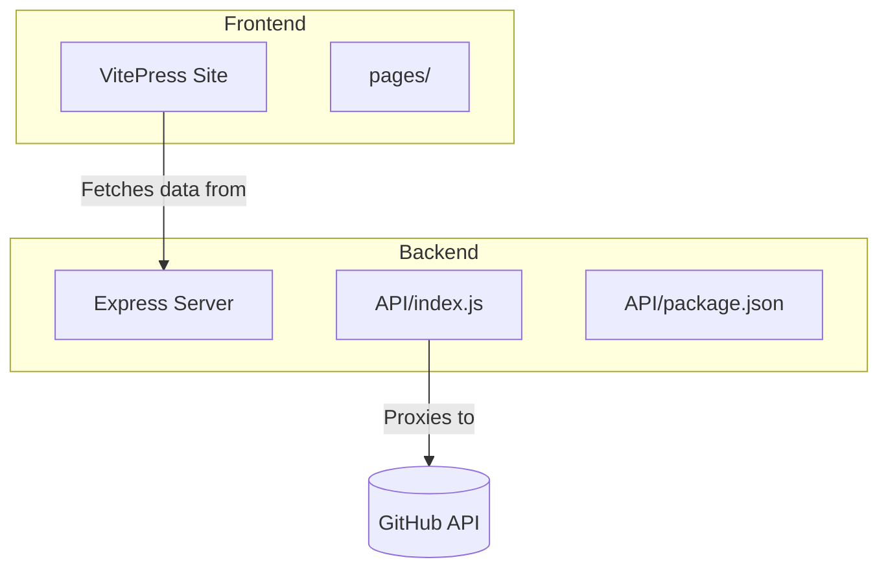
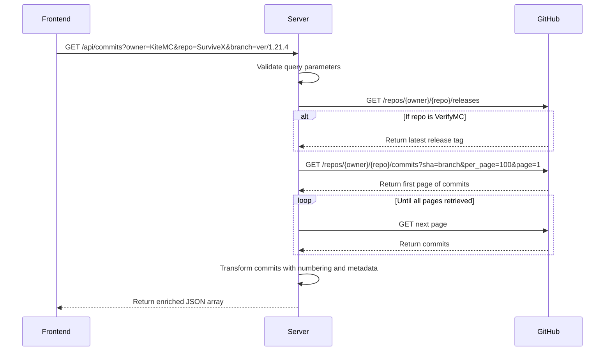
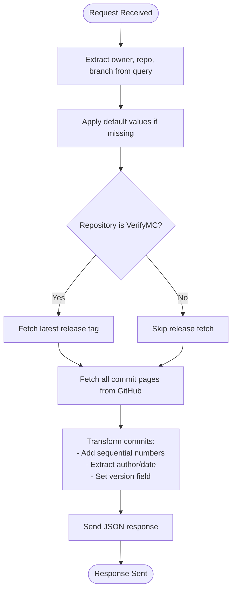
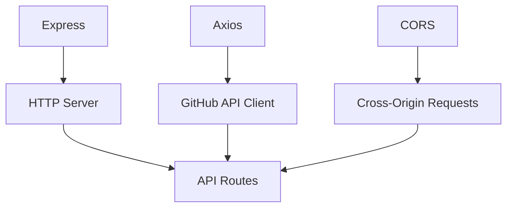

# Backend Architecture

<cite>
**Referenced Files in This Document**   
- [index.js](file://API/index.js)
- [package.json](file://API/package.json)
- [README.md](file://README.md)
</cite>

## Table of Contents
1. [Introduction](#introduction)
2. [Project Structure](#project-structure)
3. [Core Components](#core-components)
4. [Architecture Overview](#architecture-overview)
5. [Detailed Component Analysis](#detailed-component-analysis)
6. [Dependency Analysis](#dependency-analysis)
7. [Performance Considerations](#performance-considerations)
8. [Troubleshooting Guide](#troubleshooting-guide)
9. [Conclusion](#conclusion)

## Introduction

This document provides comprehensive architectural documentation for the backend system of the KiteMC website, focusing on the Express.js server implementation located in the `/API` directory. The backend serves as an API gateway that proxies and enhances GitHub API data for consumption by the frontend documentation site. It enables dynamic retrieval of repository metadata such as commits and branches from GitHub, transforming raw API responses into structured formats suitable for client-side rendering. The architecture follows a lightweight service pattern with minimal dependencies, emphasizing simplicity, security, and maintainability.

## Project Structure

The project is organized into two primary components: the frontend documentation site under `/pages` and the backend API service under `/API`. The frontend is built using VitePress, a Vue-powered static site generator, while the backend consists of a standalone Express.js application. This clear separation of concerns allows independent development and deployment of documentation content and API services. The API server runs independently on port 3000 and exposes endpoints that the frontend can consume via HTTP requests.



**Diagram sources**
- [index.js](file://API/index.js#L1-L92)
- [package.json](file://API/package.json#L1-L15)

**Section sources**
- [index.js](file://API/index.js#L1-L92)
- [package.json](file://API/package.json#L1-L15)

## Core Components

The core functionality of the backend revolves around two primary API endpoints implemented in `index.js`: `/api/commits` and `/api/branches`. These endpoints proxy requests to the GitHub REST API, enriching the data with additional logic such as version tagging for specific repositories (e.g., retrieving the latest release tag for VerifyMC). The server uses environment variables for configuration, particularly for GitHub authentication via a personal access token. Error handling is implemented at the route level to ensure robust responses even when external API calls fail.

**Section sources**
- [index.js](file://API/index.js#L15-L90)

## Architecture Overview

The backend implements an API gateway pattern, acting as an intermediary between the frontend and the GitHub API. This design provides several advantages: abstraction of GitHub's API complexity, centralized authentication management, request validation, and response normalization. The Express.js application serves as the HTTP server, handling incoming requests through defined routes. Each route processes query parameters, makes authenticated requests to GitHub using Axios, and returns JSON-formatted responses. The use of CORS middleware enables cross-origin requests from the frontend domain.

```mermaid
graph LR
A[Frontend Client] --> B[API Gateway]
B --> C{Route Dispatcher}
C --> D[/api/commits]
C --> E[/api/branches]
D --> F[GitHub API /commits]
E --> G[GitHub API /branches]
F --> H[Transform Response]
G --> I[Transform Response]
H --> J[Return JSON]
I --> J
```

**Diagram sources**
- [index.js](file://API/index.js#L15-L90)

## Detailed Component Analysis

### API Endpoint Implementation

The `/api/commits` endpoint retrieves commit history for a specified repository and branch, with default values set to the KiteMC organization's SurviveX repository on the `ver/1.21.4` branch. For the VerifyMC repository, it additionally fetches the latest release tag to include in the response as the version identifier. The implementation handles pagination automatically by iterating through GitHub API pages until all commits are retrieved (up to 100 per page). The `/api/branches` endpoint provides a simpler interface to list all branches in a repository.

#### Request Flow for Commit Data


**Diagram sources**
- [index.js](file://API/index.js#L15-L55)

#### Data Transformation Logic


**Diagram sources**
- [index.js](file://API/index.js#L15-L55)

### Middleware and Configuration

The server uses Express middleware for cross-origin resource sharing (CORS), allowing the frontend to make requests from different origins. No additional request validation middleware is implemented, relying instead on default GitHub API validation. The server logs the presence of the `GITHUB_TOKEN` environment variable at startup for debugging purposes.

**Section sources**
- [index.js](file://API/index.js#L1-L14)
- [index.js](file://API/index.js#L15-L90)

## Dependency Analysis

The backend has minimal external dependencies, consisting of three core packages: Express for HTTP server functionality, Axios for making HTTP requests to GitHub, and CORS for handling cross-origin policies. These dependencies are explicitly declared in `package.json` and are sufficient for the server's limited scope. The modular structure (`"type": "module"`) enables ES6 import syntax, improving code readability and maintainability.



**Diagram sources**
- [package.json](file://API/package.json#L1-L15)
- [index.js](file://API/index.js#L1-L92)

**Section sources**
- [package.json](file://API/package.json#L1-L15)

## Performance Considerations

The server handles pagination internally when retrieving commit data, ensuring complete datasets are returned regardless of size. However, this approach may impact response time for repositories with extensive commit histories. Each request to `/api/commits` could result in multiple sequential calls to the GitHub API, creating potential latency. Future improvements could include implementing caching mechanisms (e.g., Redis or in-memory cache) to store frequently accessed data and reduce external API calls. Rate limiting is not explicitly implemented but is implicitly handled by GitHub's API rate limits, which are respected through proper authentication.

For scalability, the current single-threaded Node.js server can handle moderate concurrent requests efficiently due to its non-blocking I/O model. Under high load, deploying multiple instances behind a load balancer or using clustering could improve throughput. The lightweight nature of the application makes it suitable for containerization and horizontal scaling.

## Troubleshooting Guide

Common issues typically relate to GitHub API authentication and rate limiting. If the `GITHUB_TOKEN` environment variable is not set, requests will still succeed but with lower rate limits (60 requests per hour for unauthenticated requests vs. 5,000 for authenticated ones). Errors from the GitHub API are caught and returned with a 500 status code and error message, which should be monitored for debugging.

To test the API locally, the `dev` script in `package.json` sets the `GITHUB_TOKEN` environment variable automatically. Ensure that the token has appropriate permissions (at minimum, `public_repo` scope for public repositories). If endpoints return empty data, verify the repository and branch names exist and are correctly cased.

**Section sources**
- [index.js](file://API/index.js#L4-L11)
- [package.json](file://API/package.json#L8-L9)

## Conclusion

The backend architecture effectively serves as a lightweight API gateway between the frontend documentation site and GitHub's API. Its simple design, focused functionality, and clean separation from the frontend make it maintainable and reliable. By abstracting GitHub API interactions and enriching the data with additional metadata, it enhances the user experience of the documentation site. Future enhancements could include caching, rate limiting, request validation, and expanded repository support, but the current implementation meets the core requirements efficiently.