# Express Server Configuration

<cite>
**Referenced Files in This Document**   
- [index.js](file://API/index.js)
- [package.json](file://API/package.json)
</cite>

## Table of Contents
1. [Introduction](#introduction)
2. [Project Structure](#project-structure)
3. [Core Components](#core-components)
4. [Architecture Overview](#architecture-overview)
5. [Detailed Component Analysis](#detailed-component-analysis)
6. [Dependency Analysis](#dependency-analysis)
7. [Performance Considerations](#performance-considerations)
8. [Troubleshooting Guide](#troubleshooting-guide)
9. [Conclusion](#conclusion)

## Introduction
This document provides comprehensive architectural documentation for the Express server configuration in API/index.js. The server functions as a lightweight API gateway that aggregates GitHub repository data for the SurviveX and VerifyMC projects. It is designed to retrieve commit histories and branch information from GitHub repositories using the GitHub REST API, serving this data to frontend applications. The configuration emphasizes simplicity and focused functionality, avoiding the complexity of a full MVC framework in favor of direct proxy operations. Key aspects include environment variable management, middleware configuration, error handling, and deployment considerations.

## Project Structure
The API component is organized in a minimalistic structure with only two core files: index.js containing the server logic and package.json defining dependencies and scripts. This flat structure reflects the server's role as a lightweight service rather than a complex application. The API directory sits alongside other project components like documentation pages, maintaining separation between the backend service and frontend/content directories.

**Diagram sources**
- [index.js](file://API/index.js)
- [package.json](file://API/package.json)

**Section sources**
- [index.js](file://API/index.js)
- [package.json](file://API/package.json)

## Core Components
The core components of this Express server include the server initialization process, API route handlers for retrieving GitHub repository data, middleware configuration for cross-origin resource sharing, and error handling mechanisms. The server acts as a proxy between frontend applications and the GitHub API, adding authentication headers when available and transforming response data into a standardized format. Environment variables are used extensively for configuration, particularly for the GitHub token authentication.

**Section sources**
- [index.js](file://API/index.js#L1-L91)
- [package.json](file://API/package.json#L1-L15)

## Architecture Overview
The Express server follows a straightforward architecture as an API gateway that proxies requests to the GitHub API. It receives HTTP requests from clients, processes them by constructing appropriate GitHub API requests, and returns the aggregated data in a consistent format. The architecture is intentionally minimal, focusing on its specific purpose of retrieving repository information without implementing complex business logic or data persistence.

**Diagram sources**
- [index.js](file://API/index.js#L1-L91)

## Detailed Component Analysis

### Server Initialization and Configuration
The server initialization process begins with importing essential dependencies (Express, Axios, and CORS), setting up the Express application instance, and configuring middleware. The server binds to port 3000 and enables CORS to allow cross-origin requests from frontend applications. Environment variables are accessed for configuration, particularly the GITHUB_TOKEN which is used for authenticated requests to the GitHub API. The server logs the GITHUB_TOKEN status during startup for debugging purposes.

#### Server Startup Flow

**Diagram sources**
- [index.js](file://API/index.js#L1-L15)

**Section sources**
- [index.js](file://API/index.js#L1-L20)

### Middleware Setup
The server implements essential middleware for proper operation. The CORS middleware allows cross-origin requests, which is critical for the server's role as an API gateway serving frontend applications that may be hosted on different domains. No additional middleware for JSON parsing or logging is explicitly configured in the code, suggesting these may be handled by the Express defaults or are not required for this specific use case. The middleware chain is minimal, reflecting the server's focused purpose and helping to minimize overhead.

**Section sources**
- [index.js](file://API/index.js#L8)

### API Route Handlers
The server implements two primary API endpoints for retrieving GitHub repository information. The /api/commits endpoint retrieves commit history from specified repositories, with special handling for the VerifyMC repository to include release tag information. The /api/branches endpoint retrieves the list of branches from a repository. Both endpoints support query parameters to customize the repository and branch, with sensible defaults provided. The handlers use Axios to make authenticated requests to the GitHub API, with error handling to return appropriate HTTP status codes and error messages.

#### API Request Flow for Commits

**Diagram sources**
- [index.js](file://API/index.js#L17-L62)

### Environment Configuration and Dependency Management
The server's dependencies are defined in package.json, including Express for the web framework, Axios for HTTP requests to the GitHub API, and CORS for handling cross-origin resource sharing. The package.json also defines scripts for starting the server in both production and development modes, with the development script including an exported GITHUB_TOKEN environment variable. This approach allows for easy testing without requiring manual environment variable setup.

#### Dependency Structure

```mermaid
graph TD
A[Express Server] --> B[express]
A --> C[axios]
A --> D[cors]
B --> E[Node.js HTTP Server]
C --> F[HTTP Client]
D --> G[CORS Headers]
style A fill:#2196F3,stroke:#1976D2
style B fill:#4CAF50,stroke:#388E3C
style C fill:#4CAF50,stroke:#388E3C
style D fill:#4CAF50,stroke:#388E3C
```

**Diagram sources**
- [package.json](file://API/package.json#L1-L15)

**Section sources**
- [package.json](file://API/package.json#L1-L15)

### Error Handling Strategy
The server implements a simple but effective error handling strategy using try-catch blocks within each route handler. When an error occurs during the processing of a request (such as a failed GitHub API call), the server catches the error and returns a 500 Internal Server Error response with a JSON object containing the error message. This approach ensures that errors are properly communicated to clients without exposing sensitive stack trace information. The error handling is implemented at the route level rather than using a centralized error handling middleware, which is appropriate for this small application.

**Section sources**
- [index.js](file://API/index.js#L58-L62)

## Dependency Analysis
The server has minimal dependencies, reflecting its role as a lightweight API gateway. The primary dependencies are Express for the web server functionality, Axios for making HTTP requests to external APIs, and CORS for handling cross-origin resource sharing. These dependencies are well-established and widely used in the Node.js ecosystem. The dependency tree is shallow, with no complex nested dependencies, which reduces the attack surface and simplifies maintenance. The use of modern ES module syntax (import statements) indicates compatibility with recent Node.js versions.

**Diagram sources**
- [package.json](file://API/package.json#L10-L14)

**Section sources**
- [package.json](file://API/package.json#L1-L15)

## Performance Considerations
While the current implementation is functional, several performance improvements could be implemented. The server currently makes multiple sequential requests to the GitHub API to retrieve all commits, which could be optimized with better pagination handling or caching strategies. Implementing response caching (particularly for frequently accessed repositories) would significantly reduce load on both the server and the GitHub API. Additionally, enabling compression middleware would reduce response sizes, and optimizing connection keep-alive settings could improve performance for clients making multiple requests. The server could also benefit from clustering to utilize multiple CPU cores, though this may be unnecessary given its lightweight nature.

## Troubleshooting Guide
Common issues with this server typically relate to environment configuration and API rate limiting. If the server fails to start, verify that Node.js version supports ES modules and