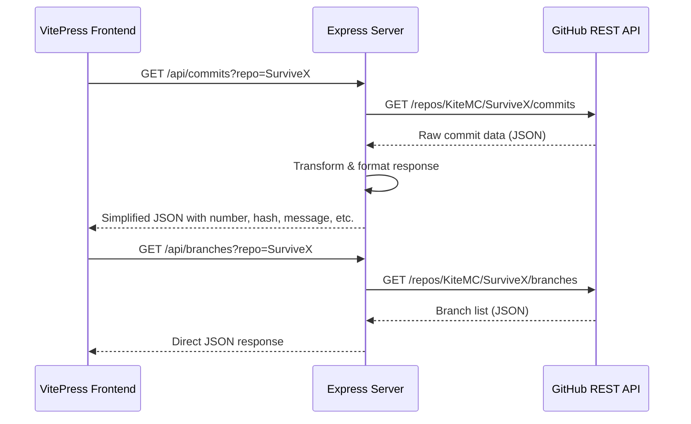
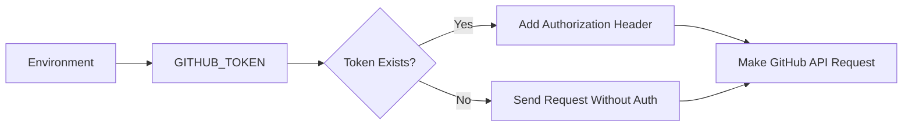
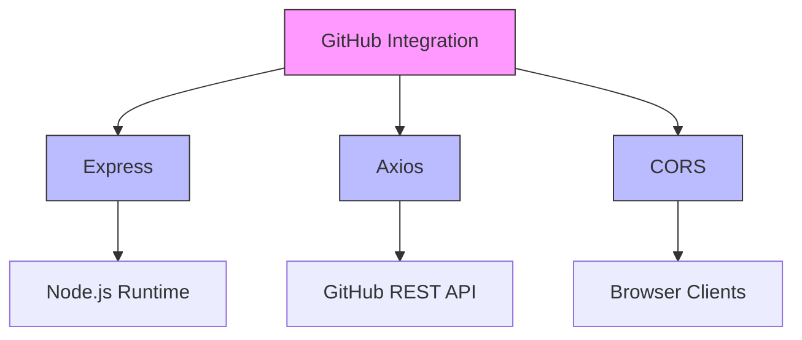

# GitHub Integration

<cite>
**Referenced Files in This Document**   
- [API/index.js](file://API/index.js)
- [API/package.json](file://API/package.json)
</cite>

## Table of Contents
1. [Introduction](#introduction)
2. [Project Structure](#project-structure)
3. [Core Components](#core-components)
4. [Architecture Overview](#architecture-overview)
5. [Detailed Component Analysis](#detailed-component-analysis)
6. [Dependency Analysis](#dependency-analysis)
7. [Performance Considerations](#performance-considerations)
8. [Troubleshooting Guide](#troubleshooting-guide)
9. [Conclusion](#conclusion)

## Introduction
This document provides comprehensive architectural documentation for the GitHub Integration component within the Express.js backend. The integration enables the VitePress frontend to retrieve repository data from the GitHub REST API through two primary endpoints: `/api/commits` and `/api/branches`. These endpoints proxy requests to GitHub, transform responses into simplified formats, and return JSON data suitable for frontend consumption. The implementation uses Axios for HTTP communication, environment-based authentication via `GITHUB_TOKEN`, and includes error handling, request transformation, and middleware for CORS and logging.

## Project Structure
The GitHub Integration component resides in the `/API` directory of the project. It is a standalone Express.js server responsible for handling external API requests to GitHub and returning processed data to the frontend. The component is decoupled from the main VitePress documentation site, allowing independent deployment and scaling.

```mermaid
graph TB
subgraph "Frontend (VitePress)"
A[Client Request]
end
subgraph "GitHub Integration API"
B[Express Server]
C[/api/commits Route]
D[/api/branches Route]
E[Environment Variables]
F[Axios HTTP Client]
end
subgraph "External Service"
G[GitHub REST API]
end
A --> B
B --> F
F --> G
G --> F
F --> B
B --> A
```

**Diagram sources**
- [API/index.js](file://API/index.js#L1-L91)

**Section sources**
- [API/index.js](file://API/index.js#L1-L91)
- [API/package.json](file://API/package.json#L1-L14)

## Core Components
The core functionality of the GitHub Integration is implemented in the `index.js` file within the `/API` directory. It exposes two main API routes: `/api/commits` and `/api/branches`, both of which act as proxies to the GitHub REST API. The component uses Axios to make authenticated HTTP requests, transforms raw GitHub responses into simplified structures, and handles errors gracefully. Authentication is managed through the `GITHUB_TOKEN` environment variable, which is conditionally included in request headers.

**Section sources**
- [API/index.js](file://API/index.js#L1-L91)

## Architecture Overview
The GitHub Integration follows a proxy-server architecture pattern, where the Express.js backend acts as an intermediary between the VitePress frontend and the GitHub REST API. This design allows the frontend to avoid direct exposure of API credentials and simplifies response formatting. The server uses CORS middleware to allow cross-origin requests from the frontend domain.



**Diagram sources**
- [API/index.js](file://API/index.js#L15-L91)

## Detailed Component Analysis

### API Routes and Request Handling
The integration provides two main endpoints that proxy requests to GitHub. Both routes accept optional query parameters (`owner`, `repo`, `branch`) with default values, allowing flexible configuration without requiring frontend changes.

#### Commits Endpoint (`/api/commits`)
This route retrieves all commits from a specified repository branch, handling pagination to fetch complete data. For the `VerifyMC` repository, it additionally fetches the latest release tag to use as the version identifier instead of the branch name.

```mermaid
flowchart TD
A[Client Request to /api/commits] --> B{Repo is VerifyMC?}
B --> |Yes| C[Fetch Latest Release Tag]
B --> |No| D[Proceed with Branch]
C --> D
D --> E[Fetch Commits via GitHub API (Paged)]
E --> F{More Pages?}
F --> |Yes| E
F --> |No| G[Transform Commit Data]
G --> H[Map to Simplified Structure]
H --> I[Return JSON Response]
```

**Diagram sources**
- [API/index.js](file://API/index.js#L15-L68)

#### Branches Endpoint (`/api/branches`)
This route retrieves the list of branches from a specified repository. It directly proxies the GitHub API response without transformation, returning the raw branch data as JSON.

**Section sources**
- [API/index.js](file://API/index.js#L69-L91)

### Authentication and Request Headers
Authentication is implemented using the `GITHUB_TOKEN` environment variable. When present, it is included in the `Authorization` header of all outgoing requests to GitHub. All requests include a custom `User-Agent` header to identify the client to GitHub's API.



**Diagram sources**
- [API/index.js](file://API/index.js#L11-L12)
- [API/index.js](file://API/index.js#L28)
- [API/index.js](file://API/index.js#L44-L45)
- [API/index.js](file://API/index.js#L79-L80)

### Response Transformation Logic
The `/api/commits` endpoint transforms raw GitHub commit data into a simplified structure optimized for frontend display. Each commit is mapped to include:
- `number`: Sequential number based on commit age (newest first)
- `hash`: Commit SHA
- `message`: Commit message
- `author`: Author name
- `date`: Commit timestamp
- `version`: Either the branch name or latest release tag (for VerifyMC)

This transformation enhances frontend performance by reducing payload size and standardizing data format.

**Section sources**
- [API/index.js](file://API/index.js#L58-L66)

### Error Handling
The integration implements centralized error handling using try-catch blocks within each route. Any errors during GitHub API communication result in a 500 Internal Server Error response with the error message included in the JSON payload. This prevents unhandled promise rejections and ensures consistent error responses.

**Section sources**
- [API/index.js](file://API/index.js#L67-L68)
- [API/index.js](file://API/index.js#L90-L91)

## Dependency Analysis
The GitHub Integration has minimal dependencies, focusing on essential functionality:



**Diagram sources**
- [API/package.json](file://API/package.json#L1-L14)

The component depends on:
- **Express**: Web server framework for handling HTTP requests
- **Axios**: HTTP client for making requests to GitHub API
- **CORS**: Middleware to enable cross-origin resource sharing

These dependencies are lightweight and focused, minimizing attack surface and maintenance overhead.

## Performance Considerations
The integration includes several performance-aware design decisions:

- **Pagination Handling**: The `/api/commits` endpoint fetches commits in pages of 100 items, continuing until all data is retrieved. This prevents timeout issues with large repositories.
- **Conditional Authentication**: The `GITHUB_TOKEN` is only included when available, avoiding unnecessary headers.
- **Direct Proxying**: The `/api/branches` endpoint returns raw GitHub data without processing, minimizing server-side computation.
- **Environment Configuration**: The dev script in `package.json` includes a sample `GITHUB_TOKEN`, facilitating local testing without configuration overhead.

However, the current implementation lacks response caching, which could improve performance for frequently accessed repositories. Implementing in-memory or Redis-based caching would reduce GitHub API calls and improve response times.

**Section sources**
- [API/index.js](file://API/index.js#L36-L56)
- [API/package.json](file://API/package.json#L8-L10)

## Troubleshooting Guide
Common issues and their solutions:

- **Authentication Failures**: Ensure `GITHUB_TOKEN` is set in the environment. The token must have sufficient permissions to access the target repositories.
- **Empty Responses**: Verify that the repository and branch names are correct. Private repositories require a token with appropriate access.
- **Rate Limiting**: GitHub API rate limits apply. Using a `GITHUB_TOKEN` increases the rate limit from 60 to 5000 requests per hour.
- **Network Timeouts**: Large repositories may take time to fetch all commits. Ensure the server has adequate timeout settings.
- **CORS Errors**: The `cors()` middleware is enabled, but deployment environment may require additional configuration for allowed origins.

**Section sources**
- [API/index.js](file://API/index.js#L11-L12)
- [API/index.js](file://API/index.js#L44-L45)
- [API/index.js](file://API/index.js#L79-L80)

## Conclusion
The GitHub Integration component effectively bridges the VitePress frontend with the GitHub REST API, providing essential repository data in a secure and efficient manner. By using Express.js as a proxy server with Axios for HTTP communication, the implementation maintains clean separation of concerns and simplifies frontend integration. The use of environment variables for authentication enhances security, while response transformation optimizes data for frontend consumption. Future improvements could include response caching, request throttling, and enhanced error handling for specific GitHub API error codes.