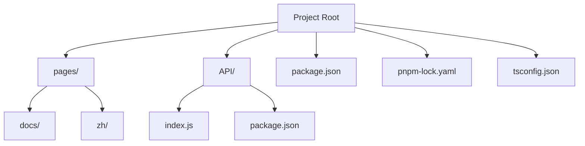
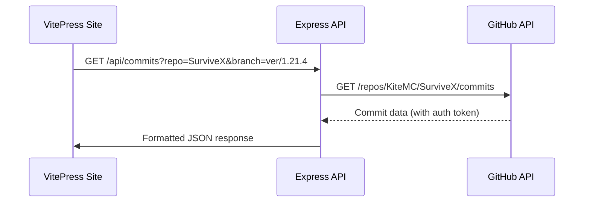
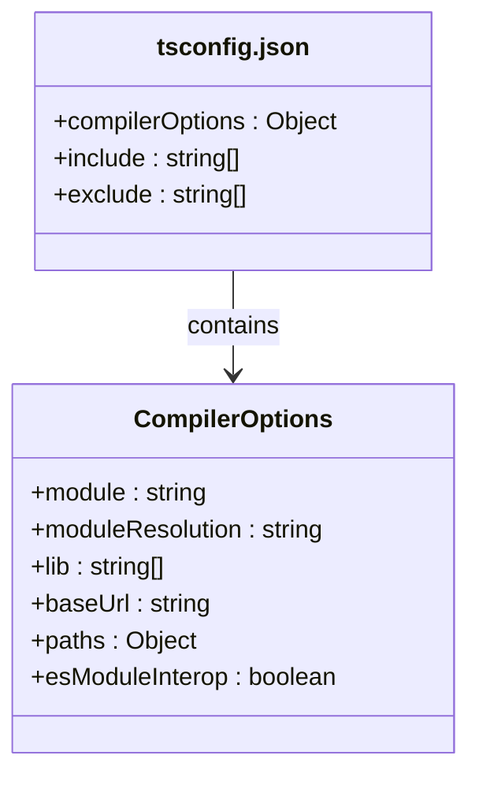

# Developer Onboarding Guide

<cite>
**Referenced Files in This Document**   
- [package.json](file://package.json)
- [pnpm-lock.yaml](file://pnpm-lock.yaml)
- [tsconfig.json](file://tsconfig.json)
- [README.md](file://README.md)
- [API/index.js](file://API/index.js)
- [API/package.json](file://API/package.json)
</cite>

## Table of Contents
1. [Introduction](#introduction)
2. [Development Environment Setup](#development-environment-setup)
3. [Project Structure Overview](#project-structure-overview)
4. [Frontend Development with VitePress](#frontend-development-with-vitepress)
5. [Backend API Server](#backend-api-server)
6. [Environment Variables and GitHub Integration](#environment-variables-and-github-integration)
7. [TypeScript Configuration](#typescript-configuration)
8. [Available Script Commands](#available-script-commands)
9. [Contribution Workflow](#contribution-workflow)
10. [Testing Changes](#testing-changes)
11. [Common Setup Issues and Solutions](#common-setup-issues-and-solutions)
12. [Conclusion](#conclusion)

## Introduction

This guide provides a comprehensive walkthrough for developers joining the KiteMC website project. It covers everything from setting up your local development environment to contributing changes through pull requests. The website is built using VitePress for documentation and an Express.js backend for API functionality, with pnpm as the package manager.

**Section sources**
- [README.md](file://README.md#L1-L27)

## Development Environment Setup

To begin development, ensure you have the following prerequisites installed:

- **Node.js**: Version 18.20 or higher
- **pnpm**: Package manager used for dependency management

Install dependencies using pnpm by running the following command in the project root:

```bash
pnpm install
```

This will read dependencies from `package.json` and `pnpm-lock.yaml` to install the exact versions required for consistency across development environments.

After installing frontend dependencies, navigate to the `API` directory and install backend dependencies:

```bash
cd API
pnpm install
```

**Section sources**
- [package.json](file://package.json#L1-L18)
- [API/package.json](file://API/package.json#L1-L15)
- [README.md](file://README.md#L7-L10)

## Project Structure Overview

The project is organized into two main components:

- **pages/**: Contains all documentation content in Markdown format, including both English (`docs/`) and Chinese (`zh/`) versions
- **API/**: Houses the Express.js backend server that provides GitHub commit data via REST endpoints

The root directory contains configuration files for the build system, TypeScript, and package management.



**Diagram sources**
- [package.json](file://package.json#L1-L18)
- [API/package.json](file://API/package.json#L1-L15)

**Section sources**
- [README.md](file://README.md#L1-L27)
- [project_structure](file://README.md#L1-L27)

## Frontend Development with VitePress

The frontend documentation site is built using VitePress, a Vue-powered static site generator. To start the development server:

```bash
pnpm run dev
```

This command launches the VitePress development server with hot module replacement, accessible at `http://localhost:3000` by default. The `--host` flag in the dev script allows network access to the server.

All documentation content resides in the `pages/docs` and `pages/zh/docs` directories, organized by product (`survivex`, `verifymc`) and category (`basic`, `deploy`, `guide`, etc.).

**Section sources**
- [package.json](file://package.json#L7-L10)
- [README.md](file://README.md#L19-L22)

## Backend API Server

The Express.js backend server in the `API/` directory provides RESTful endpoints for retrieving GitHub repository data. Key endpoints include:

- `GET /api/commits`: Retrieves commit history for a specified repository and branch
- `GET /api/branches`: Lists all branches for a specified repository

Start the backend server using:

```bash
cd API
pnpm run dev
```

The dev script includes an exported `GITHUB_TOKEN` environment variable for increased API rate limits. The server runs on port 3000 by default.



**Diagram sources**
- [API/index.js](file://API/index.js#L1-L92)
- [API/package.json](file://API/package.json#L7-L10)

**Section sources**
- [API/index.js](file://API/index.js#L1-L92)
- [API/package.json](file://API/package.json#L1-L15)

## Environment Variables and GitHub Integration

The API server requires a `GITHUB_TOKEN` environment variable for accessing GitHub's API with higher rate limits. This is particularly important for retrieving large commit histories.

For development, the token is hardcoded in the `dev` script in `API/package.json`. In production, this should be set via environment variables.

To generate a GitHub token:
1. Go to GitHub Settings → Developer settings → Personal access tokens
2. Create a new token with `public_repo` scope
3. Store it securely and avoid committing to version control

The API uses this token to authenticate requests to GitHub, allowing up to 5,000 requests per hour instead of the unauthenticated limit of 60.

**Section sources**
- [API/index.js](file://API/index.js#L7-L15)
- [API/package.json](file://API/package.json#L9-L10)

## TypeScript Configuration

The project uses TypeScript for type safety and enhanced developer experience. The configuration is defined in `tsconfig.json` with the following key settings:

- **Module system**: ESNext with Bundler resolution
- **Base URL**: Project root for absolute imports
- **Path mapping**: `@/*` maps to root directory
- **Libraries**: Includes modern ECMAScript and DOM APIs
- **Include**: Specifies TypeScript files in `.vitepress` and `pages` directories

This configuration enables modern JavaScript features while maintaining compatibility with the VitePress build system.



**Diagram sources**
- [tsconfig.json](file://tsconfig.json#L1-L24)

**Section sources**
- [tsconfig.json](file://tsconfig.json#L1-L24)

## Available Script Commands

The project provides several npm scripts through `package.json` for different development tasks:

### Frontend Scripts
- `dev`: Starts VitePress development server with hot reload
- `build`: Compiles documentation into static assets
- `preview`: Serves built assets locally to simulate production

### Backend Scripts
- `start`: Runs the Express.js server in production mode
- `dev`: Starts server with GitHub token for development

Use these scripts with pnpm:
```bash
pnpm run dev        # Frontend development
pnpm run build      # Build documentation
pnpm run preview    # Preview built site
cd API && pnpm run dev  # Start API server
```

**Section sources**
- [package.json](file://package.json#L7-L10)
- [API/package.json](file://API/package.json#L7-L10)

## Contribution Workflow

To contribute to the project:

1. **Fork** the repository on GitHub
2. **Clone** your fork locally
3. **Create a feature branch** for your changes
4. Make your modifications and **commit** with descriptive messages
5. **Push** your branch to your fork
6. Open a **Pull Request** to the main repository

When making changes:
- Update documentation in both English (`pages/docs`) and Chinese (`pages/zh/docs`) when applicable
- Follow existing formatting and style conventions
- Test both frontend and backend changes locally before submitting

The project uses Markdown for documentation with VitePress-specific syntax for enhanced rendering.

**Section sources**
- [README.md](file://README.md#L1-L27)
- [pages/docs](file://README.md#L1-L27)

## Testing Changes

### Frontend Testing
1. Start the development server: `pnpm run dev`
2. Navigate to affected pages in the browser
3. Verify content rendering and navigation
4. Check responsive design across device sizes

### Backend Testing
1. Start the API server: `cd API && pnpm run dev`
2. Test endpoints using curl or a REST client:
   ```bash
   curl "http://localhost:3000/api/commits?repo=SurviveX&branch=ver/1.21.4"
   ```
3. Verify JSON response structure and data accuracy
4. Test error handling by providing invalid parameters

Use the `preview` command to test the complete built site before submission.

**Section sources**
- [package.json](file://package.json#L7-L10)
- [API/index.js](file://API/index.js#L15-L92)

## Common Setup Issues and Solutions

### Node.js Version Mismatch
**Issue**: Commands fail with syntax errors  
**Solution**: Ensure Node.js 18.20+ is installed and active

### pnpm Not Found
**Issue**: `pnpm` command not recognized  
**Solution**: Install pnpm globally: `npm install -g pnpm`

### API Rate Limiting
**Issue**: GitHub API returns 403 errors  
**Solution**: Set a valid GITHUB_TOKEN environment variable

### Port Conflicts
**Issue**: "Port already in use" errors  
**Solution**: Change ports or terminate conflicting processes

### Missing Dependencies
**Issue**: Module not found errors  
**Solution**: Run `pnpm install` in both root and `API` directories

**Section sources**
- [README.md](file://README.md#L7-L10)
- [API/index.js](file://API/index.js#L7-L15)

## Conclusion

This guide has covered the complete setup and contribution process for the KiteMC website. You should now be able to set up your development environment, run both frontend and backend servers, and contribute changes to the project. Remember to follow the contribution workflow and test your changes thoroughly before submitting pull requests. The combination of VitePress for documentation and Express.js for API functionality provides a powerful platform for delivering high-quality technical content.