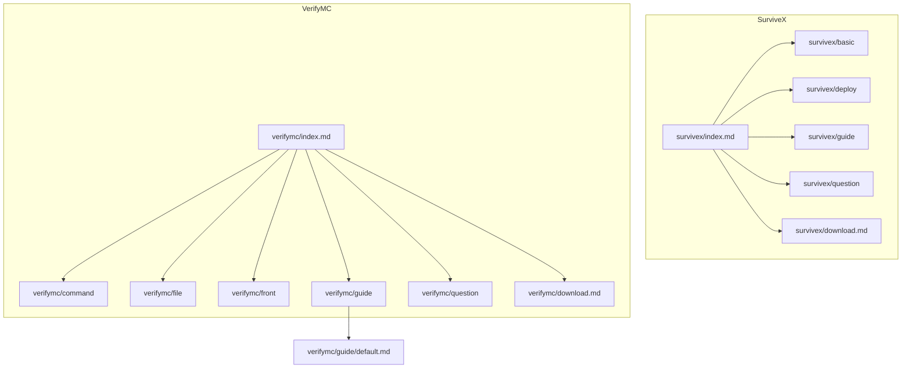
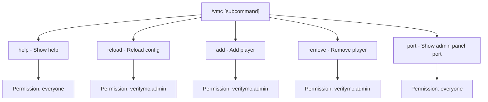
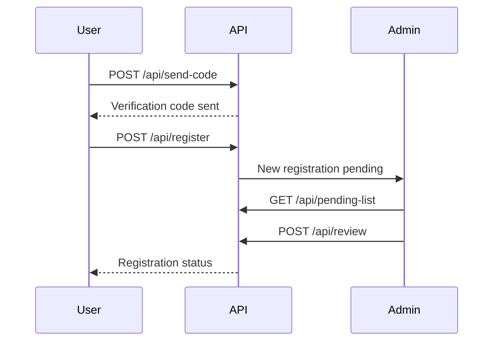
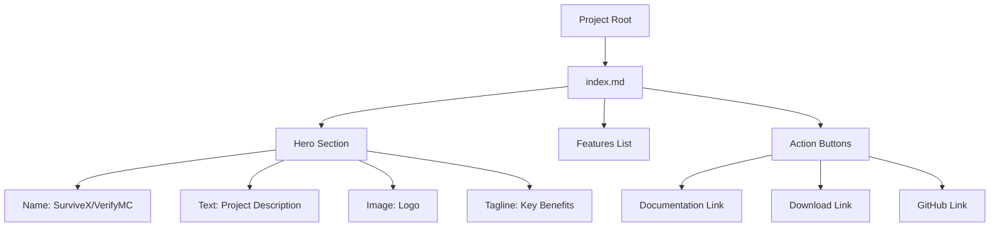
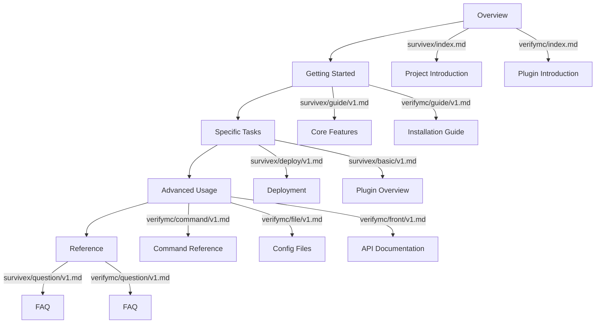

# Content Organization

<cite>
**Referenced Files in This Document**   
- [survivex/index.md](file://pages/docs/survivex/index.md)
- [verifymc/index.md](file://pages/docs/verifymc/index.md)
- [survivex/basic/v1.md](file://pages/docs/survivex/basic/v1.md)
- [verifymc/command/v1.md](file://pages/docs/verifymc/command/v1.md)
- [survivex/download.md](file://pages/docs/survivex/download.md)
- [verifymc/download.md](file://pages/docs/verifymc/download.md)
- [survivex/guide/v1.md](file://pages/docs/survivex/guide/v1.md)
- [verifymc/guide/v1.md](file://pages/docs/verifymc/guide/v1.md)
- [survivex/deploy/v1.md](file://pages/docs/survivex/deploy/v1.md)
- [verifymc/file/v1.md](file://pages/docs/verifymc/file/v1.md)
- [survivex/question/v1.md](file://pages/docs/survivex/question/v1.md)
- [verifymc/question/v1.md](file://pages/docs/verifymc/question/v1.md)
- [verifymc/front/v1.md](file://pages/docs/verifymc/front/v1.md)
- [verifymc/guide/default.md](file://pages/docs/verifymc/guide/default.md)
</cite>

## Table of Contents
1. [Introduction](#introduction)
2. [Project Structure Overview](#project-structure-overview)
3. [Documentation Categories](#documentation-categories)
4. [Index Pages as Entry Points](#index-pages-as-entry-points)
5. [Download Pages for Resource Access](#download-pages-for-resource-access)
6. [Content Flow from Overview to Implementation](#content-flow-from-overview-to-implementation)
7. [Best Practices for Documentation Structure](#best-practices-for-documentation-structure)
8. [Conclusion](#conclusion)

## Introduction

This document provides a comprehensive analysis of the documentation structure for two Minecraft-related software projects: SurviveX and VerifyMC. It details how content is organized by type, the purpose of each category, and how users navigate from high-level overviews to detailed implementation specifics. The analysis covers core documentation components including basic features, deployment guides, user guides, command references, configuration files, and FAQs, with concrete examples from both projects.

**Section sources**
- [survivex/index.md](file://pages/docs/survivex/index.md)
- [verifymc/index.md](file://pages/docs/verifymc/index.md)

## Project Structure Overview

The documentation for both SurviveX and VerifyMC follows a consistent directory structure within the `pages/docs` folder. Each project has its own subdirectory containing categorized content:

- **basic**: Foundational concepts and plugin overviews
- **deploy**: Deployment and setup instructions
- **guide**: Comprehensive user guides
- **command**: Command syntax and usage
- **file**: Configuration file structures
- **front**: API and frontend integration details
- **question**: Frequently asked questions
- **download.md**: Resource access page
- **index.md**: Main entry point for the documentation

This organization enables clear separation of concerns and logical navigation paths for users.

**Diagram sources**
- [survivex/index.md](file://pages/docs/survivex/index.md)
- [verifymc/index.md](file://pages/docs/verifymc/index.md)

**Section sources**
- [survivex/index.md](file://pages/docs/survivex/index.md)
- [verifymc/index.md](file://pages/docs/verifymc/index.md)

## Documentation Categories

### Basic Features Documentation

The basic features documentation provides foundational knowledge about core components and plugins. For SurviveX, `survivex/basic/v1.md` offers an extensive overview of 32 essential plugins, detailing their descriptions, use cases, and external links. Each entry follows a consistent format with clear categorization of functionality.

**Section sources**
- [survivex/basic/v1.md](file://pages/docs/survivex/basic/v1.md)

### Deployment Guides

Deployment guides offer step-by-step instructions for setting up and running the software. The `survivex/deploy/v1.md` file provides specific guidance for Windows users, covering Java 21 installation and server startup procedures. This category targets users who need practical, actionable instructions to get started.

**Section sources**
- [survivex/deploy/v1.md](file://pages/docs/survivex/deploy/v1.md)

### User Guides

User guides deliver comprehensive introductions and feature overviews. Both projects maintain detailed guides:
- `survivex/guide/v1.md` covers core features, environment setup, plugin ecosystem, and quick start instructions
- `verifymc/guide/v1.md` includes introduction, key features, screenshots, tech stack, and installation/configuration details

These guides serve as primary resources for understanding the full capabilities of each system.

**Section sources**
- [survivex/guide/v1.md](file://pages/docs/survivex/guide/v1.md)
- [verifymc/guide/v1.md](file://pages/docs/verifymc/guide/v1.md)

### Command References

Command references provide syntax and usage information for plugin commands. `verifymc/command/v1.md` documents the `/vmc` command structure with subcommands, permissions, descriptions, and examples in a tabular format. This category is essential for administrators and advanced users who need precise command information.

**Diagram sources**
- [verifymc/command/v1.md](file://pages/docs/verifymc/command/v1.md)

**Section sources**
- [verifymc/command/v1.md](file://pages/docs/verifymc/command/v1.md)

### Configuration Files

Configuration file documentation explains the structure and settings of configuration files. `verifymc/file/v1.md` presents a complete directory tree of the VerifyMC plugin, showing all configuration files, email templates, static assets, internationalization files, data storage, and backup locations. This helps users understand where to find and modify various configuration elements.

**Section sources**
- [verifymc/file/v1.md](file://pages/docs/verifymc/file/v1.md)

### API and Frontend Integration

For advanced users and developers, API documentation provides technical details for integration. `verifymc/front/v1.md` contains comprehensive API documentation with endpoints, request/response formats, parameters, and examples for user registration, verification, admin operations, and status queries. This enables secondary development and custom integrations.

**Diagram sources**
- [verifymc/front/v1.md](file://pages/docs/verifymc/front/v1.md)

**Section sources**
- [verifymc/front/v1.md](file://pages/docs/verifymc/front/v1.md)

### Frequently Asked Questions

FAQ sections address common user inquiries. Both projects have `question/v1.md` files that serve as placeholders for frequently asked questions, though currently they indicate that content has not been supplemented yet. These sections are intended to provide quick answers to common issues and usage questions.

**Section sources**
- [survivex/question/v1.md](file://pages/docs/survivex/question/v1.md)
- [verifymc/question/v1.md](file://pages/docs/verifymc/question/v1.md)

## Index Pages as Entry Points

The `index.md` files serve as the primary entry points for each project's documentation tree. They are structured using VitePress frontmatter to define layout, hero sections, and features:

- `survivex/index.md` presents SurviveX as high-performance Minecraft server software with core features, basic features, advanced features, and performance optimization highlights
- `verifymc/index.md` introduces VerifyMC as a modern whitelist and registration plugin with emphasis on email verification, admin management, multi-theme UI, and security

Both index pages include action buttons linking to documentation, downloads, and GitHub repositories, providing immediate navigation options for users.

**Diagram sources**
- [survivex/index.md](file://pages/docs/survivex/index.md)
- [verifymc/index.md](file://pages/docs/verifymc/index.md)

**Section sources**
- [survivex/index.md](file://pages/docs/survivex/index.md)
- [verifymc/index.md](file://pages/docs/verifymc/index.md)

## Download Pages for Resource Access

The `download.md` pages provide access to software resources and artifacts. Both `survivex/download.md` and `verifymc/download.md` use the same structure, importing a `DownloadPage` component and passing repository information through props:

- They disable sidebars using frontmatter (`aside: false`)
- They import the `DownloadPage` component from `@theme/components/download/DownloadPage.vue`
- They use the `<ClientOnly>` wrapper to ensure client-side rendering
- They specify the GitHub owner and repository for each project

This consistent approach ensures users can easily access downloadable artifacts while maintaining a uniform interface across projects.

**Section sources**
- [survivex/download.md](file://pages/docs/survivex/download.md)
- [verifymc/download.md](file://pages/docs/verifymc/download.md)

## Content Flow from Overview to Implementation

The documentation structure supports a natural progression from overview to implementation details, catering to both new users and advanced developers:

1. **Overview Level**: Index pages provide high-level introductions with visual elements and key features
2. **Getting Started**: User guides offer comprehensive introductions and quick start instructions
3. **Specific Tasks**: Deployment guides and basic feature documentation address specific use cases
4. **Advanced Usage**: Command references, configuration files, and API documentation support complex operations
5. **Reference Materials**: FAQ sections and additional guides provide supplemental information

This hierarchical flow enables users to quickly find relevant information based on their expertise level and immediate needs. New users can start with overviews and guides, while experienced users can jump directly to command references or API documentation.

**Diagram sources**
- [survivex/index.md](file://pages/docs/survivex/index.md)
- [verifymc/index.md](file://pages/docs/verifymc/index.md)
- [survivex/guide/v1.md](file://pages/docs/survivex/guide/v1.md)
- [verifymc/guide/v1.md](file://pages/docs/verifymc/guide/v1.md)
- [survivex/deploy/v1.md](file://pages/docs/survivex/deploy/v1.md)
- [survivex/basic/v1.md](file://pages/docs/survivex/basic/v1.md)
- [verifymc/command/v1.md](file://pages/docs/verifymc/command/v1.md)
- [verifymc/file/v1.md](file://pages/docs/verifymc/file/v1.md)
- [verifymc/front/v1.md](file://pages/docs/verifymc/front/v1.md)
- [survivex/question/v1.md](file://pages/docs/survivex/question/v1.md)
- [verifymc/question/v1.md](file://pages/docs/verifymc/question/v1.md)

**Section sources**
- [survivex/index.md](file://pages/docs/survivex/index.md)
- [verifymc/index.md](file://pages/docs/verifymc/index.md)
- [survivex/guide/v1.md](file://pages/docs/survivex/guide/v1.md)
- [verifymc/guide/v1.md](file://pages/docs/verifymc/guide/v1.md)
- [survivex/deploy/v1.md](file://pages/docs/survivex/deploy/v1.md)
- [survivex/basic/v1.md](file://pages/docs/survivex/basic/v1.md)
- [verifymc/command/v1.md](file://pages/docs/verifymc/command/v1.md)
- [verifymc/file/v1.md](file://pages/docs/verifymc/file/v1.md)
- [verifymc/front/v1.md](file://pages/docs/verifymc/front/v1.md)
- [survivex/question/v1.md](file://pages/docs/survivex/question/v1.md)
- [verifymc/question/v1.md](file://pages/docs/verifymc/question/v1.md)

## Best Practices for Documentation Structure

Based on the analysis of both projects, several best practices emerge for maintaining consistent and effective documentation:

### Consistent Directory Structure
Maintain identical category names across projects (`basic`, `guide`, `command`, etc.) to create predictable navigation patterns. This consistency reduces cognitive load for users familiar with one project when moving to another.

### Clear Entry Points
Use `index.md` files as comprehensive landing pages with visual elements, feature highlights, and clear action buttons. This provides immediate context and navigation options for new visitors.

### Progressive Disclosure
Organize content to support progressive disclosure, starting with high-level overviews and gradually revealing more detailed information. This accommodates users with varying levels of expertise and information needs.

### Standardized Components
Reuse common components like the `DownloadPage` across projects to ensure visual and functional consistency. This reduces maintenance overhead and provides a uniform user experience.

### Versioned Documentation
Use versioned files (e.g., `v1.md`, `v2.md`) to manage documentation evolution while maintaining backward compatibility. This allows for iterative improvements without breaking existing links.

### Comprehensive API Documentation
For