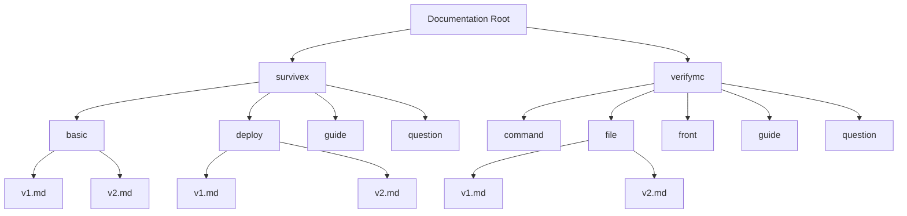
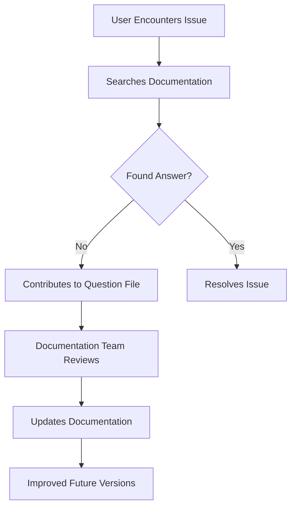

# Versioning Strategy

<cite>
**Referenced Files in This Document**   
- [survivex/basic/v1.md](file://pages/docs/survivex/basic/v1.md)
- [survivex/basic/v2.md](file://pages/docs/survivex/basic/v2.md)
- [survivex/deploy/v1.md](file://pages/docs/survivex/deploy/v1.md)
- [survivex/deploy/v2.md](file://pages/docs/survivex/deploy/v2.md)
- [survivex/guide/v1.md](file://pages/docs/survivex/guide/v1.md)
- [survivex/question/v1.md](file://pages/docs/survivex/question/v1.md)
- [verifymc/command/v1.md](file://pages/docs/verifymc/command/v1.md)
- [verifymc/file/v1.md](file://pages/docs/verifymc/file/v1.md)
- [verifymc/file/v2.md](file://pages/docs/verifymc/file/v2.md)
- [verifymc/front/v1.md](file://pages/docs/verifymc/front/v1.md)
- [verifymc/guide/v1.md](file://pages/docs/verifymc/guide/v1.md)
- [verifymc/question/v1.md](file://pages/docs/verifymc/question/v1.md)
</cite>

## Table of Contents
1. [Introduction](#introduction)
2. [Versioning Structure and Organization](#versioning-structure-and-organization)
3. [Content Evolution and Breaking Changes](#content-evolution-and-breaking-changes)
4. [Process for Creating New Versioned Documentation](#process-for-creating-new-versioned-documentation)
5. [Deprecation of Old Versions](#deprecation-of-old-versions)
6. [Maintenance and Review Process](#maintenance-and-review-process)
7. [Quality Assurance Through Question Files](#quality-assurance-through-question-files)
8. [Guidelines for Contributors](#guidelines-for-contributors)
9. [Backward Compatibility and Migration Support](#backward-compatibility-and-migration-support)
10. [User Navigation and Version Selection](#user-navigation-and-version-selection)
11. [Conclusion](#conclusion)

## Introduction
The documentation system for SurviveX and VerifyMC employs a structured versioning strategy using the `v1.md`, `v2.md` file naming convention to maintain parallel documentation versions for different software releases. This approach enables users to access guidance specific to their software version, ensuring accurate and relevant information is available regardless of the release they are using. The versioning system supports both major and minor updates, allowing for content evolution while preserving historical documentation for legacy users.

**Section sources**
- [survivex/basic/v1.md](file://pages/docs/survivex/basic/v1.md)
- [survivex/basic/v2.md](file://pages/docs/survivex/basic/v2.md)

## Versioning Structure and Organization
The documentation is organized under product-specific directories (`survivex`, `verifymc`) with subdirectories for different documentation categories such as `basic`, `deploy`, `file`, and `command`. Each category contains versioned Markdown files (`v1.md`, `v2.md`) that correspond to specific software releases. This hierarchical structure allows for logical grouping of related documentation while maintaining version isolation.

The versioning approach follows a consistent pattern across both SurviveX and VerifyMC documentation, with each version file containing comprehensive information specific to that release. For example, the `survivex/basic/v1.md` and `survivex/basic/v2.md` files document different aspects of the SurviveX platform, with v1 focusing on plugin overviews and v2 on basic commands.

**Diagram sources**
- [survivex/basic/v1.md](file://pages/docs/survivex/basic/v1.md)
- [survivex/basic/v2.md](file://pages/docs/survivex/basic/v2.md)
- [survivex/deploy/v1.md](file://pages/docs/survivex/deploy/v1.md)
- [survivex/deploy/v2.md](file://pages/docs/survivex/deploy/v2.md)
- [verifymc/file/v1.md](file://pages/docs/verifymc/file/v1.md)
- [verifymc/file/v2.md](file://pages/docs/verifymc/file/v2.md)

**Section sources**
- [survivex/basic/v1.md](file://pages/docs/survivex/basic/v1.md)
- [survivex/basic/v2.md](file://pages/docs/survivex/basic/v2.md)
- [survivex/deploy/v1.md](file://pages/docs/survivex/deploy/v1.md)
- [survivex/deploy/v2.md](file://pages/docs/survivex/deploy/v2.md)
- [verifymc/file/v1.md](file://pages/docs/verifymc/file/v1.md)
- [verifymc/file/v2.md](file://pages/docs/verifymc/file/v2.md)

## Content Evolution and Breaking Changes
The versioning strategy effectively illustrates content evolution between software releases, with clear examples of breaking changes and feature additions. The transition from `survivex/basic/v1.md` to `survivex/basic/v2.md` demonstrates a significant shift in content focus, moving from plugin overviews to detailed command documentation.

In the VerifyMC documentation, the evolution from `verifymc/file/v1.md` to `verifymc/file/v2.md` shows enhanced detail and organization, with v2 providing comprehensive descriptions of configuration files and directory structures that were only minimally documented in v1. This progression reflects the maturation of the documentation alongside the software itself.

The versioning system captures breaking changes through complete content rewrites rather than incremental updates, ensuring that each version's documentation accurately reflects the state of the software at that release. For example, the deployment documentation for SurviveX changed from a Windows-focused guide in v1 to a Linux and Docker-focused guide in v2, reflecting a significant shift in the recommended deployment approach.

**Section sources**
- [survivex/basic/v1.md](file://pages/docs/survivex/basic/v1.md#L1-L170)
- [survivex/basic/v2.md](file://pages/docs/survivex/basic/v2.md#L1-L468)
- [verifymc/file/v1.md](file://pages/docs/verifymc/file/v1.md#L1-L30)
- [verifymc/file/v2.md](file://pages/docs/verifymc/file/v2.md#L1-L40)

## Process for Creating New Versioned Documentation
The process for creating new versioned documentation follows a standardized workflow that begins with identifying significant changes in the software that warrant a new documentation version. When major features are added, removed, or significantly modified, a new version file (e.g., v3.md) is created by duplicating the previous version and systematically updating the content to reflect the current state of the software.

The creation process involves several key steps:
1. Analyzing the changes between software versions
2. Determining whether the changes require a new documentation version or can be addressed with updates to the existing version
3. Creating a new version file with appropriate naming
4. Updating content to reflect new features, commands, configuration options, and workflows
5. Reviewing the new documentation against the actual software implementation

For example, the creation of `survivex/deploy/v2.md` represented a complete overhaul of the deployment documentation to reflect a shift from Windows-based deployment to a Linux and Docker-based approach, indicating a significant change in the recommended deployment methodology.

**Section sources**
- [survivex/deploy/v1.md](file://pages/docs/survivex/deploy/v1.md)
- [survivex/deploy/v2.md](file://pages/docs/survivex/deploy/v2.md)

## Deprecation of Old Versions
Old documentation versions are not removed from the repository but are effectively deprecated through the organization and navigation structure. The versioning system maintains backward compatibility by preserving all previous versions, allowing users of older software releases to continue accessing relevant documentation.

Deprecation is indicated through several mechanisms:
- The main documentation index points to the latest version as the default
- Version-specific content may include deprecation notices (as seen in the "plugin is no longer maintained" tips in various files)
- Newer versions supersede older ones in search results and navigation

The system does not employ formal deprecation markers or automated redirects, relying instead on clear version labeling and organizational structure to guide users toward the most appropriate documentation for their needs.

**Section sources**
- [survivex/basic/v1.md](file://pages/docs/survivex/basic/v1.md)
- [survivex/basic/v2.md](file://pages/docs/survivex/basic/v2.md)
- [survivex/guide/v1.md](file://pages/docs/survivex/guide/v1.md)

## Maintenance and Review Process
The documentation is maintained through a continuous review process that aligns with software development cycles. Each version is reviewed and updated when corresponding software changes are implemented, ensuring documentation accuracy.

The maintenance process includes:
- Regular audits of existing documentation for accuracy
- Updates to reflect software changes and bug fixes
- Incorporation of user feedback and frequently asked questions
- Verification of commands, configuration options, and procedures

The presence of version-specific files allows for targeted maintenance, where updates can be applied to specific versions without affecting others. This is particularly important for enterprise users who may be running older software versions and require documentation that matches their specific release.

**Section sources**
- [survivex/basic/v1.md](file://pages/docs/survivex/basic/v1.md)
- [survivex/basic/v2.md](file://pages/docs/survivex/basic/v2.md)
- [verifymc/guide/v1.md](file://pages/docs/verifymc/guide/v1.md)

## Quality Assurance Through Question Files
The documentation system includes a quality assurance mechanism through the use of `question/v1.md` files in both the SurviveX and VerifyMC documentation trees. These files serve as placeholders for frequently asked questions and user feedback, providing a structured way to identify gaps in the documentation.

Although the current `question/v1.md` files contain minimal content with the note "This post has not been supplemented yet," their presence indicates an intentional design for collecting and addressing user questions. This approach allows the documentation team to:
- Identify common user confusion points
- Track frequently requested information
- Prioritize documentation improvements
- Ensure comprehensive coverage of user needs

The question files act as a feedback loop, helping to maintain documentation quality by highlighting areas that require clarification or expansion in future versions.

**Diagram sources**
- [survivex/question/v1.md](file://pages/docs/survivex/question/v1.md)
- [verifymc/question/v1.md](file://pages/docs/verifymc/question/v1.md)

**Section sources**
- [survivex/question/v1.md](file://pages/docs/survivex/question/v1.md)
- [verifymc/question/v1.md](file://pages/docs/verifymc/question/v1.md)

## Guidelines for Contributors
Contributors to the documentation should follow these guidelines when working with the versioning system:

1. **When to create a new version**: Create a new version file when there are significant changes to the software that would make the existing documentation inaccurate or incomplete. This includes major feature additions, removals, or substantial changes to workflows, commands, or configuration.

2. **When to update existing content**: Update existing version files for minor corrections, clarifications, or additions that do not change the fundamental nature of the documented features. This includes fixing typos, improving explanations, or adding examples.

3. **Version naming convention**: Follow the `v{number}.md` pattern consistently, incrementing the version number sequentially. Do not skip version numbers or use non-numeric identifiers.

4. **Content scope**: Each version should be self-contained and comprehensive for its corresponding software release, not assuming knowledge from other versions.

5. **Cross-version references**: When appropriate, include references to other versions to help users understand changes, but ensure each version can stand alone.

**Section sources**
- [survivex/basic/v1.md](file://pages/docs/survivex/basic/v1.md)
- [survivex/basic/v2.md](file://pages/docs/survivex/basic/v2.md)
- [verifymc/file/v1.md](file://pages/docs/verifymc/file/v1.md)
- [verifymc/file/v2.md](file://pages/docs/verifymc/file/v2.md)

## Backward Compatibility and Migration Support
The versioning strategy supports backward compatibility by maintaining documentation for all previous versions, allowing users to reference the appropriate documentation for their software release. This is particularly important for enterprise users who may be running older versions due to stability requirements or integration constraints.

The documentation also supports migration between versions by providing clear examples of changes, such as the evolution from `survivex/basic/v1.md` to `survivex/basic/v2.md`, which helps users understand how features and workflows have changed. The side-by-side availability of different versions enables users to compare documentation across releases, facilitating smoother upgrades and migrations.

For VerifyMC, the progression from `file/v1.md` to `file/v2.md` demonstrates how the documentation has evolved to provide more detailed information about configuration files and directory structures, helping users understand changes in the plugin's file organization between versions.

**Section sources**
- [survivex/basic/v1.md](file://pages/docs/survivex/basic/v1.md)
- [survivex/basic/v2.md](file://pages/docs/survivex/basic/v2.md)
- [verifymc/file/v1.md](file://pages/docs/verifymc/file/v1.md)
- [verifymc/file/v2.md](file://pages/docs/verifymc/file/v2.md)

## User Navigation and Version Selection
Users are directed to the appropriate documentation version through several mechanisms:

1. **Directory structure**: The clear organization of documentation by product and version allows users to easily locate the version that matches their software release.

2. **Index pointers**: The main documentation index files (like `survivex/index.md`) typically point to the latest version as the default entry point.

3. **Version labeling**: Clear version labels (v1, v2) help users identify which documentation corresponds to their software version.

4. **Contextual links**: Documentation may include links to other versions when relevant, helping users understand changes between releases.

The system assumes that users know their software version and can select the appropriate documentation accordingly. For example, the SurviveX documentation homepage links to `./guide/v1`, establishing v1 as the default version for that product line.

**Section sources**
- [survivex/index.md](file://pages/docs/survivex/index.md)
- [survivex