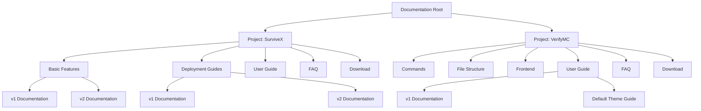
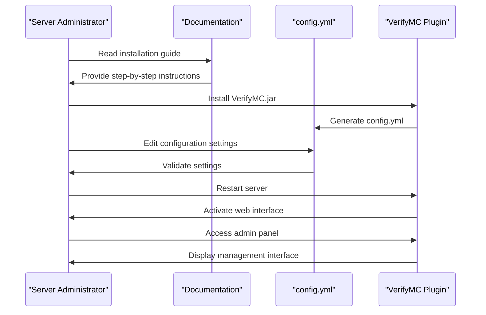
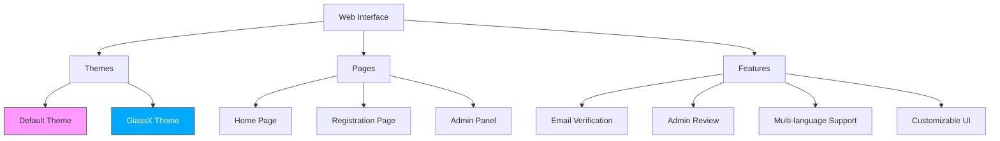
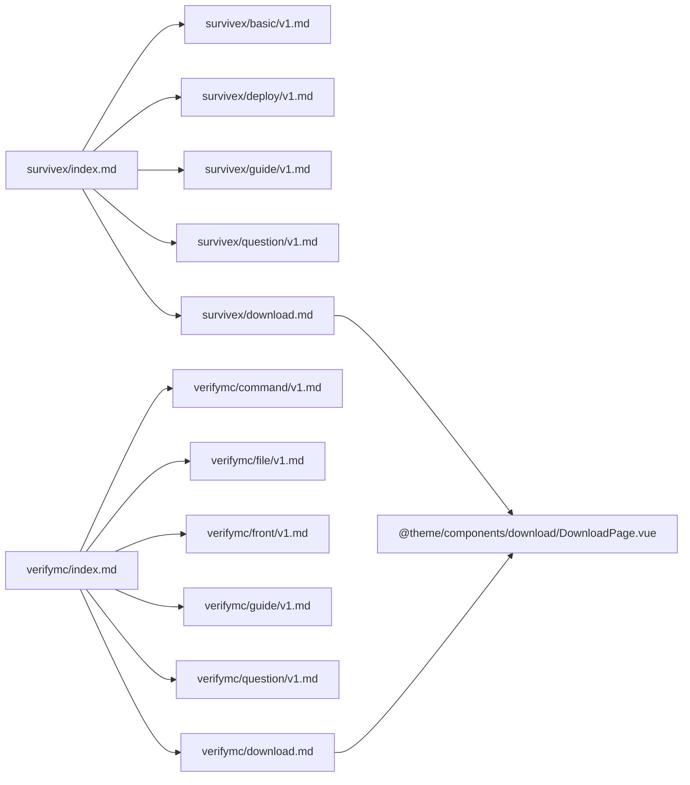

# Documentation Structure

<cite>
**Referenced Files in This Document**   
- [survivex/index.md](file://pages/docs/survivex/index.md)
- [survivex/basic/v1.md](file://pages/docs/survivex/basic/v1.md)
- [survivex/basic/v2.md](file://pages/docs/survivex/basic/v2.md)
- [survivex/deploy/v1.md](file://pages/docs/survivex/deploy/v1.md)
- [survivex/deploy/v2.md](file://pages/docs/survivex/deploy/v2.md)
- [survivex/guide/v1.md](file://pages/docs/survivex/guide/v1.md)
- [survivex/question/v1.md](file://pages/docs/survivex/question/v1.md)
- [survivex/download.md](file://pages/docs/survivex/download.md)
- [verifymc/index.md](file://pages/docs/verifymc/index.md)
- [verifymc/guide/v1.md](file://pages/docs/verifymc/guide/v1.md)
- [verifymc/guide/default.md](file://pages/docs/verifymc/guide/default.md)
- [verifymc/file/v1.md](file://pages/docs/verifymc/file/v1.md)
- [verifymc/command/v1.md](file://pages/docs/verifymc/command/v1.md)
- [verifymc/question/v1.md](file://pages/docs/verifymc/question/v1.md)
- [verifymc/download.md](file://pages/docs/verifymc/download.md)
</cite>

## Table of Contents
1. [Introduction](#introduction)
2. [Project Structure](#project-structure)
3. [Core Components](#core-components)
4. [Architecture Overview](#architecture-overview)
5. [Detailed Component Analysis](#detailed-component-analysis)
6. [Dependency Analysis](#dependency-analysis)
7. [Performance Considerations](#performance-considerations)
8. [Troubleshooting Guide](#troubleshooting-guide)
9. [Conclusion](#conclusion)

## Introduction
This document provides a comprehensive analysis of the documentation architecture for two Minecraft-related software projects: SurviveX and VerifyMC. The structure is designed to support versioned, scalable, and user-friendly documentation delivery through a hierarchical organization system. The `/pages/docs` directory serves as the central hub for project-specific documentation, implementing a clean separation between different products while maintaining consistent navigation patterns and formatting standards.

## Project Structure

The documentation system is organized under the `/pages/docs` directory with dedicated subdirectories for each project: `survivex` and `verifymc`. Each project directory contains categorized content sections including basic features, deployment guides, user guides, FAQs, and download information. Versioning is implemented through dedicated `v1.md` and `v2.md` files within feature-specific subdirectories, enabling parallel documentation tracks for different software versions.

```mermaid
graph TB
docs[/pages/docs] --> survivex[survivex/]
docs --> verifymc[verifymc/]
survivex --> basic[basic/]
survivex --> deploy[deploy/]
survivex --> guide[guide/]
survivex --> question[question/]
survivex --> download[download.md]
survivex --> index[index.md]
verifymc --> command[command/]
verifymc --> file[file/]
verifymc --> front[front/]
verifymc --> guide[guide/]
verifymc --> question[question/]
verifymc --> download[download.md]
verifymc --> index[index.md]
basic --> v1[v1.md]
basic --> v2[v2.md]
deploy --> v1[v1.md]
deploy --> v2[v2.md]
guide --> v1[v1.md]
guide --> default[default.md]
file --> v1[v1.md]
file --> v2[v2.md]
```

**Diagram sources**
- [survivex/index.md](file://pages/docs/survivex/index.md)
- [verifymc/index.md](file://pages/docs/verifymc/index.md)
- [survivex/basic/v1.md](file://pages/docs/survivex/basic/v1.md)
- [survivex/basic/v2.md](file://pages/docs/survivex/basic/v2.md)
- [survivex/deploy/v1.md](file://pages/docs/survivex/deploy/v1.md)
- [survivex/deploy/v2.md](file://pages/docs/survivex/deploy/v2.md)
- [verifymc/guide/v1.md](file://pages/docs/verifymc/guide/v1.md)
- [verifymc/guide/default.md](file://pages/docs/verifymc/guide/default.md)
- [verifymc/file/v1.md](file://pages/docs/verifymc/file/v1.md)
- [verifymc/command/v1.md](file://pages/docs/verifymc/command/v1.md)

**Section sources**
- [survivex/index.md](file://pages/docs/survivex/index.md)
- [verifymc/index.md](file://pages/docs/verifymc/index.md)

## Core Components

The documentation structure centers around two main projects: SurviveX (a high-performance Minecraft server software) and VerifyMC (a whitelist and registration plugin). Each project utilizes an `index.md` file as a landing page that defines the hero section, features list, and primary call-to-action buttons. The content is organized into thematic categories such as basic features, deployment procedures, user guides, and command references, with version-specific documentation files enabling support for multiple software versions.

**Section sources**
- [survivex/index.md](file://pages/docs/survivex/index.md)
- [verifymc/index.md](file://pages/docs/verifymc/index.md)
- [survivex/guide/v1.md](file://pages/docs/survivex/guide/v1.md)
- [verifymc/guide/v1.md](file://pages/docs/verifymc/guide/v1.md)

## Architecture Overview

The documentation architecture follows a hierarchical pattern where each project has its own dedicated directory containing categorized content sections. The use of versioned markdown files (`v1.md`, `v2.md`) within feature directories allows for maintaining multiple documentation versions simultaneously. The `index.md` files serve as entry points with rich metadata including hero banners, feature lists, and action buttons that guide users to key resources. This structure supports scalability by allowing new projects to be added as top-level directories and new versions to be introduced through additional versioned files.



**Diagram sources**
- [survivex/index.md](file://pages/docs/survivex/index.md)
- [verifymc/index.md](file://pages/docs/verifymc/index.md)
- [survivex/basic/v1.md](file://pages/docs/survivex/basic/v1.md)
- [survivex/basic/v2.md](file://pages/docs/survivex/basic/v2.md)
- [survivex/deploy/v1.md](file://pages/docs/survivex/deploy/v1.md)
- [survivex/deploy/v2.md](file://pages/docs/survivex/deploy/v2.md)
- [verifymc/guide/v1.md](file://pages/docs/verifymc/guide/v1.md)
- [verifymc/guide/default.md](file://pages/docs/verifymc/guide/default.md)

## Detailed Component Analysis

### SurviveX Documentation Analysis

The SurviveX documentation is structured to provide comprehensive information about the server software, including plugin overviews, deployment instructions, and user guides. The `basic/v1.md` file contains detailed descriptions of 32 plugins with their functionality, use cases, and external links. The `basic/v2.md` file provides command references for these plugins, organized by plugin name with syntax and usage examples. Deployment guides are versioned, with `v1.md` covering Windows setup and `v2.md` detailing Linux server configuration using Docker and MCSManager.

**Section sources**
- [survivex/basic/v1.md](file://pages/docs/survivex/basic/v1.md)
- [survivex/basic/v2.md](file://pages/docs/survivex/basic/v2.md)
- [survivex/deploy/v1.md](file://pages/docs/survivex/deploy/v1.md)
- [survivex/deploy/v2.md](file://pages/docs/survivex/deploy/v2.md)
- [survivex/guide/v1.md](file://pages/docs/survivex/guide/v1.md)

#### Plugin Overview Structure
```mermaid
classDiagram
class PluginOverview {
+string title
+string description
+string use_cases
+string link
}
PluginOverview <|-- Nightcore
PluginOverview <|-- AntiPopup
PluginOverview <|-- AntiSeedCracker
PluginOverview <|-- AuthMe
PluginOverview <|-- BanItem
PluginOverview <|-- BellCommand
PluginOverview <|-- BetterRTP
PluginOverview <|-- CMI
PluginOverview <|-- CMIEInjector
PluginOverview <|-- CMILib
PluginOverview <|-- Chunky
PluginOverview <|-- CommandAPI
PluginOverview <|-- Essentials
PluginOverview <|-- ExcellentEnchants
PluginOverview <|-- Jobs
PluginOverview <|-- LuckPerms
PluginOverview <|-- MiniMOTD
PluginOverview <|-- Orebfuscator
PluginOverview <|-- PlaceholderAPI
PluginOverview <|-- Plan
PluginOverview <|-- PlayerDataRollback
PluginOverview <|-- PlayerMenu
PluginOverview <|-- ProtocolLib
PluginOverview <|-- QuickShop-Hikari
PluginOverview <|-- Residence
PluginOverview <|-- SkinsRestorer
PluginOverview <|-- TAB
PluginOverview <|-- Vault
PluginOverview <|-- ViaVersion
PluginOverview <|-- WorldManager
PluginOverview <|-- fakeplayer
PluginOverview <|-- floodgate
}
```

**Diagram sources**
- [survivex/basic/v1.md](file://pages/docs/survivex/basic/v1.md)

#### Command Reference Structure

```mermaid
flowchart TD
Start([Command Categories]) --> PlayerCommands["Player Common Commands"]
PlayerCommands --> RTP["/rtp - Random Teleport"]
PlayerCommands --> TPA["/tpa - Teleport Request"]
PlayerCommands --> Home["/sethome, /home - Home Management"]
PlayerCommands --> FakePlayer["/fp - FakePlayer Commands"]
Start --> PluginCommands["Plugin-Specific Commands"]
PluginCommands --> Chunky["/chunky - World Pre-generation"]
PluginCommands --> Jobs["/jobs - Job System Management"]
PluginCommands --> LuckPerms["/lp - Permission Management"]
PluginCommands --> QuickShop["/quickshop - Shop Management"]
PluginCommands --> Residence["/res - Territory Protection"]
PluginCommands --> TAB["/tab - TAB List Customization"]
PluginCommands --> ViaVersion["/viaversion - Version Compatibility"]
PluginCommands --> WorldManager["/worldmanager - World Management"]
style Start fill:#f9f,stroke:#333
style PlayerCommands fill:#bbf,stroke:#333
style PluginCommands fill:#bbf,stroke:#333
```


**Diagram sources**
- [survivex/basic/v2.md](file://pages/docs/survivex/basic/v2.md)

### VerifyMC Documentation Analysis

The VerifyMC documentation focuses on the plugin's core functionality as a whitelist and registration system. The `guide/v1.md` file provides a comprehensive overview of features, installation steps, and configuration options with YAML examples. The `command/v1.md` file details the plugin's command structure with permissions and usage examples. The `file/v1.md` describes the plugin's directory structure and data storage mechanisms. A unique feature is the `guide/default.md` file which provides screenshots of the default theme interface, demonstrating the multi-theme capability.

**Section sources**
- [verifymc/guide/v1.md](file://pages/docs/verifymc/guide/v1.md)
- [verifymc/command/v1.md](file://pages/docs/verifymc/command/v1.md)
- [verifymc/file/v1.md](file://pages/docs/verifymc/file/v1.md)
- [verifymc/guide/default.md](file://pages/docs/verifymc/guide/default.md)

#### Configuration and Command Flow


**Diagram sources**
- [verifymc/guide/v1.md](file://pages/docs/verifymc/guide/v1.md)
- [verifymc/command/v1.md](file://pages/docs/verifymc/command/v1.md)

#### Theme and Interface Structure


**Diagram sources**
- [verifymc/guide/v1.md](file://pages/docs/verifymc/guide/v1.md)
- [verifymc/guide/default.md](file://pages/docs/verifymc/guide/default.md)

## Dependency Analysis

The documentation structure shows a clear dependency pattern where each project's `index.md` file serves as the primary entry point, linking to versioned content files within specific categories. The versioning system creates parallel documentation tracks that can evolve independently, allowing v1 and v2 content to coexist without conflict. The use of consistent file naming conventions (`v1.md`, `v2.md`) across different categories enables predictable navigation patterns. The `download.md` files have a special dependency on a shared Vue component (`DownloadPage.vue`) that dynamically loads release information from GitHub repositories.



**Diagram sources**
- [survivex/index.md](file://pages/docs/survivex/index.md)
- [survivex/basic/v1.md](file://pages/docs/survivex/basic/v1.md)
- [survivex/deploy/v1.md](file://pages/docs/survivex/deploy/v1.md)
- [survivex/guide/v1.md](file://pages/docs/survivex/guide/v1.md)
- [survivex/question/v1.md](file://pages/docs/survivex/question/v1.md)
- [survivex/download.md](file://pages/docs/survivex/download.md)
- [verifymc/index.md](file://pages/docs/verifymc/index.md)
- [verifymc/command/v1.md](file://pages/docs/verifymc/command/v1.md)
- [verifymc/file/v1.md](file://pages/docs/verifymc/file/v1.md)
- [verifymc/front/v1.md](file://pages/docs/verifymc/front/v1.md)
- [verifymc/guide/v1.md](file://pages/docs/verifymc/guide/v1.md)
- [verifymc/question/v1.md](file://pages/docs/verifymc/question/v1.md)
- [verifymc/download.md](file://pages/docs/verifymc/download.md)

## Performance Considerations

The documentation architecture is optimized for fast loading and efficient content delivery. The use of static markdown files allows for server-side rendering and caching at the CDN level. Versioned documentation files enable selective updates without affecting other versions. The hierarchical structure minimizes deep nesting while maintaining logical organization. The implementation of `index.md` landing pages with concise feature summaries provides quick overviews without requiring users to load extensive content initially. The separation of concerns between different documentation categories (basic, deploy, guide, etc.) allows for targeted content loading based on user needs.

## Troubleshooting Guide

The current documentation structure includes placeholder FAQ sections (`question/v1.md`) for both projects, indicating that comprehensive troubleshooting content is planned but not yet implemented. Based on the existing structure, troubleshooting information would be organized under the `question` directory with versioned files mirroring the pattern used in other categories. Effective troubleshooting documentation should include common issues, error messages, diagnostic steps, and resolution procedures, potentially organized by category (installation, configuration, runtime, etc.). The versioning system would allow for maintaining troubleshooting guides specific to each software version.

**Section sources**
- [survivex/question/v1.md](file://pages/docs/survivex/question/v1.md)
- [verifymc/question/v1.md](file://pages/docs/verifymc/question/v1.md)

## Conclusion

The documentation structure for SurviveX and VerifyMC demonstrates a well-organized, scalable approach to technical documentation. The hierarchical organization with project-specific directories, categorized content sections, and versioned files provides a clear navigation path for users. The use of `index.md` files as landing pages with rich metadata enhances user engagement and discovery. The consistent naming conventions and structural patterns across projects enable maintainability and ease of extension. This architecture effectively supports the documentation needs of complex software projects with multiple versions and feature sets, providing a solid foundation for delivering comprehensive, user-friendly documentation.