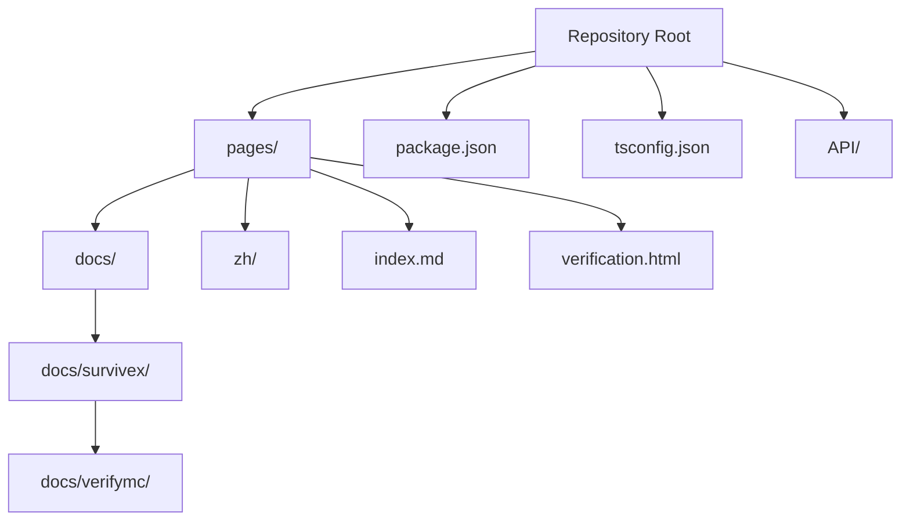
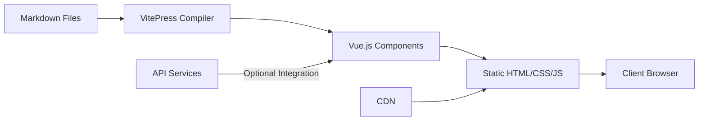
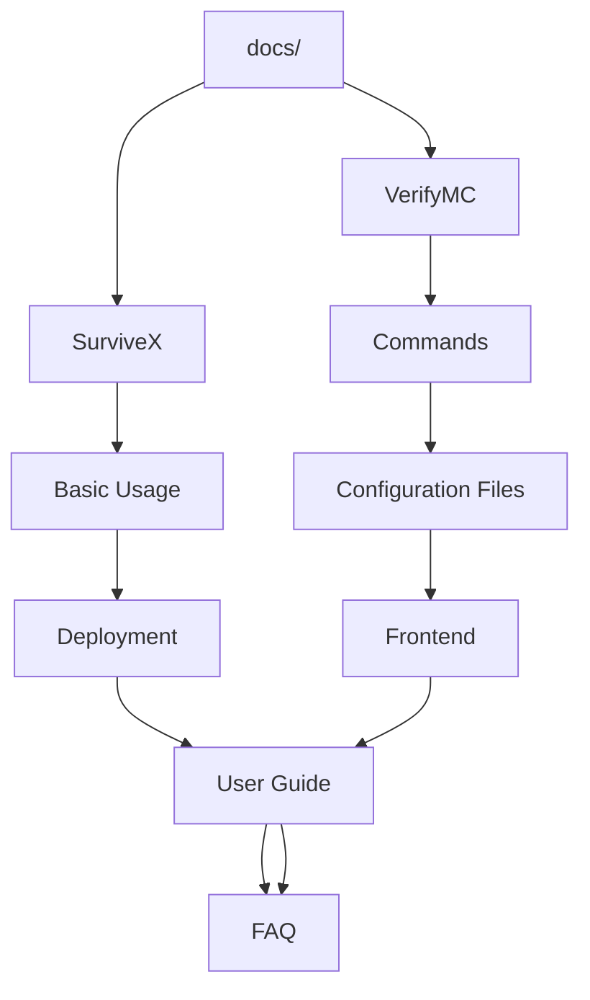
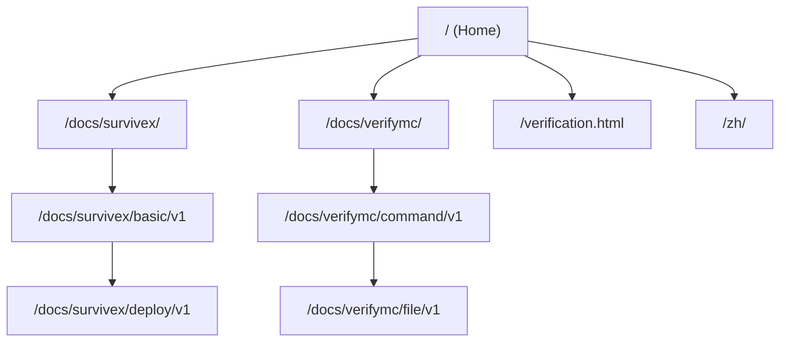

# Frontend Architecture

<cite>
**Referenced Files in This Document**   
- [index.md](file://pages/index.md)
- [zh/index.md](file://pages/zh/index.md)
- [verification.html](file://pages/verification.html)
- [package.json](file://package.json)
- [tsconfig.json](file://tsconfig.json)
- [pages/docs/survivex/index.md](file://pages/docs/survivex/index.md)
- [pages/docs/verifymc/index.md](file://pages/docs/verifymc/index.md)
</cite>

## Table of Contents
1. [Introduction](#introduction)
2. [Project Structure](#project-structure)
3. [Core Components](#core-components)
4. [Architecture Overview](#architecture-overview)
5. [Detailed Component Analysis](#detailed-component-analysis)
6. [Dependency Analysis](#dependency-analysis)
7. [Performance Considerations](#performance-considerations)
8. [Troubleshooting Guide](#troubleshooting-guide)
9. [Conclusion](#conclusion)

## Introduction
This document provides a comprehensive overview of the frontend architecture for the KiteMC documentation website. The site is built using VitePress, a Vue.js-based static site generator optimized for technical documentation. It serves as a centralized portal for multiple projects including SurviveX, VerifyMC, and Rainyun, with full multi-language support through parallel content structures. The architecture emphasizes static content delivery, SEO optimization, and seamless navigation between documentation sections.

## Project Structure

The project follows a VitePress-optimized directory structure with clear separation between content, configuration, and assets. The `/pages` directory serves as the root for all site content, containing both documentation and special pages.



**Diagram sources**
- [pages/index.md](file://pages/index.md)
- [pages/docs/survivex/index.md](file://pages/docs/survivex/index.md)
- [pages/docs/verifymc/index.md](file://pages/docs/verifymc/index.md)

**Section sources**
- [pages/index.md](file://pages/index.md)
- [pages/zh/index.md](file://pages/zh/index.md)

## Core Components

The core components of the frontend architecture include the VitePress framework, multi-language content structure, and custom routing system. The homepage (`index.md`) defines the site's hero section and feature cards that link to project documentation. The `/docs` directory contains nested documentation for individual projects, each with its own subdirectory structure for different documentation types (basic, deploy, guide, etc.). The `/zh` directory mirrors the entire content structure for Chinese language support, ensuring content parity across languages.

**Section sources**
- [pages/index.md](file://pages/index.md)
- [pages/zh/index.md](file://pages/zh/index.md)
- [pages/docs/survivex/index.md](file://pages/docs/survivex/index.md)
- [pages/docs/verifymc/index.md](file://pages/docs/verifymc/index.md)

## Architecture Overview

The architecture follows a static site generation model where Markdown files are transformed into a fully interactive Vue.js application during build time. VitePress handles the compilation process, converting `.md` files into HTML with enhanced interactivity through Vue components.



**Diagram sources**
- [package.json](file://package.json)
- [pages/index.md](file://pages/index.md)

## Detailed Component Analysis

### Content Structure Analysis

The content structure is organized around project-specific documentation with versioned content (v1.md, v2.md) indicating documentation evolution. Each project directory contains thematic subdirectories that categorize documentation by purpose.



**Diagram sources**
- [pages/docs/survivex/index.md](file://pages/docs/survivex/index.md)
- [pages/docs/verifymc/index.md](file://pages/docs/verifymc/index.md)

**Section sources**
- [pages/docs/survivex/index.md](file://pages/docs/survivex/index.md)
- [pages/docs/verifymc/index.md](file://pages/docs/verifymc/index.md)

### Multi-language Implementation

The multi-language system is implemented through parallel directory structures, with the `/zh` directory mirroring the English content structure. This approach ensures complete content parity while maintaining separate translation workflows.

```mermaid
graph LR
en[English Content]
--> root[index.md]
--> docs[docs/]
zh[Chinese Content]
--> zh_dir[zh/]
--> zh_docs[zh/docs/]
en < --> |Content Parity| zh
style en fill:#f9f,stroke:#333
style zh fill:#bbf,stroke:#333
```

**Diagram sources**
- [pages/index.md](file://pages/index.md)
- [pages/zh/index.md](file://pages/zh/index.md)

### Routing System Analysis

The routing system is automatically generated by VitePress based on the file structure, with predictable URL patterns that map directly to the directory hierarchy.



**Diagram sources**
- [pages/index.md](file://pages/index.md)
- [pages/verification.html](file://pages/verification.html)

## Dependency Analysis

The project dependencies are minimal and focused on the VitePress ecosystem, with Vue.js as the core framework and supporting libraries for enhanced functionality.

```mermaid
graph LR
VitePress[vitepress]
--> Vue[Vue.js]
--> Compiler[@vue/compiler-core]
VitePress --> Markdown[markdown-it]
VitePress --> Icons[@iconify/vue]
VitePress --> DevUtils[@vueuse/core]
style VitePress fill:#409EFF,stroke:#333
style Vue fill:#409EFF,stroke:#333
style Markdown fill:#409EFF,stroke:#333
```

**Diagram sources**
- [package.json](file://package.json)
- [pnpm-lock.yaml](file://pnpm-lock.yaml)

**Section sources**
- [package.json](file://package.json)
- [pnpm-lock.yaml](file://pnpm-lock.yaml)

## Performance Considerations

The static site architecture provides excellent performance characteristics with fast load times and efficient CDN delivery. VitePress optimizes assets during build time, generating static HTML that can be served without server-side processing. The use of Vue.js enables progressive enhancement, where core content is immediately available while interactive elements load asynchronously. SEO is optimized through semantic HTML generation and proper meta tag implementation in the Markdown frontmatter.

## Troubleshooting Guide

Common issues in this architecture typically relate to content structure, routing, or build configuration. Ensure that Markdown files have proper frontmatter configuration, directory structures are consistent between language versions, and that all dependencies are properly installed. The `verification.html` file appears to be a static verification token for domain ownership or service integration, and should be preserved at the root level without modification.

**Section sources**
- [pages/verification.html](file://pages/verification.html)
- [package.json](file://package.json)

## Conclusion

The frontend architecture effectively leverages VitePress to create a scalable, multi-language documentation portal. The clean separation of content and presentation, combined with automated static generation, results in a high-performance site that is easy to maintain and extend. The parallel language structure ensures content parity while allowing independent translation workflows, and the project-based organization makes documentation discoverable and intuitive to navigate.