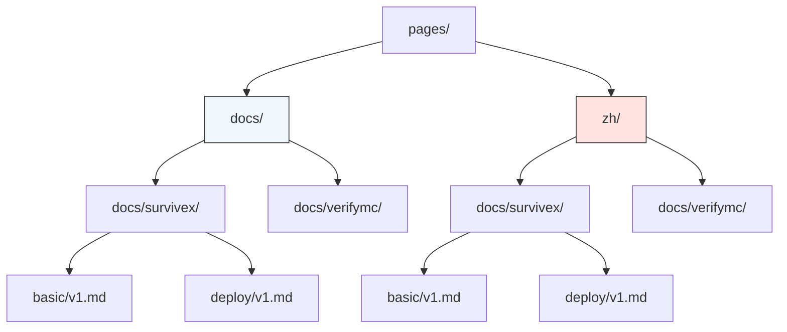

# Multi-Language Implementation

<cite>
**Referenced Files in This Document**   
- [index.md](file://pages/index.md)
- [zh/index.md](file://pages/zh/index.md)
- [docs/survivex/index.md](file://pages/docs/survivex/index.md)
- [docs/zh/survivex/index.md](file://pages/zh/docs/survivex/index.md)
- [docs/survivex/basic/v1.md](file://pages/docs/survivex/basic/v1.md)
- [docs/zh/survivex/basic/v1.md](file://pages/zh/docs/survivex/basic/v1.md)
- [docs/verifymc/guide/default.md](file://pages/docs/verifymc/guide/default.md)
- [docs/zh/verifymc/guide/default.md](file://pages/zh/docs/verifymc/guide/default.md)
- [README.md](file://README.md)
</cite>

## Table of Contents
1. [Introduction](#introduction)
2. [Directory Structure for Multi-Language Support](#directory-structure-for-multi-language-support)
3. [File-Level Correspondence Between Languages](#file-level-correspondence-between-languages)
4. [Routing Mechanism and Language Switching](#routing-mechanism-and-language-switching)
5. [Content Parity and Synchronization Strategies](#content-parity-and-synchronization-strategies)
6. [Challenges in Maintaining Translation Consistency](#challenges-in-maintaining-translation-consistency)
7. [Best Practices for Adding New Language Translations](#best-practices-for-adding-new-language-translations)
8. [Conclusion](#conclusion)

## Introduction
The website implements a multi-language frontend architecture to support both English (default) and Chinese (zh) documentation. This design enables global accessibility while maintaining structural consistency across language versions. The implementation leverages VitePress, a Vue-powered static site generator, which natively supports internationalization through parallel directory structures. This document details the architecture, file correspondence, routing mechanism, and maintenance strategies for ensuring content parity between language versions.

**Section sources**
- [README.md](file://README.md#L1-L27)
- [index.md](file://pages/index.md#L1-L37)
- [zh/index.md](file://pages/zh/index.md#L1-L37)

## Directory Structure for Multi-Language Support
The multi-language implementation follows a parallel directory pattern where the `zh/` directory mirrors the structure of the default English content under `pages/`. This approach ensures that each document has a direct counterpart in the other language, facilitating predictable navigation and systematic translation management.

The root `pages/` directory contains the default English documentation, while `pages/zh/` houses the Chinese translations. Both directories maintain identical subdirectory hierarchies including `docs/survivex/`, `docs/verifymc/`, and associated subfolders such as `basic/`, `guide/`, `deploy/`, and `question/`. Each `.md` file in the English path has a corresponding file with the same name and relative path in the Chinese directory.

This mirrored structure simplifies language switching and allows for deterministic URL routing based on language prefixes. It also enables automated tools to verify translation coverage by comparing file counts and paths between the two language trees.

**Diagram sources**
- [pages/docs/survivex/basic/v1.md](file://pages/docs/survivex/basic/v1.md)
- [pages/zh/docs/survivex/basic/v1.md](file://pages/zh/docs/survivex/basic/v1.md)

**Section sources**
- [pages/docs/survivex/basic/v1.md](file://pages/docs/survivex/basic/v1.md)
- [pages/zh/docs/survivex/basic/v1.md](file://pages/zh/docs/survivex/basic/v1.md)

## File-Level Correspondence Between Languages
Each English documentation file has a direct counterpart in the Chinese directory with identical relative path and filename. For example, `/pages/docs/survivex/basic/v1.md` corresponds exactly to `/pages/zh/docs/survivex/basic/v1.md`. This one-to-one mapping ensures that all content sections are available in both languages.

Analysis of the file structure reveals complete translation coverage for core documentation:
- SurviveX documentation includes translated versions for `basic/`, `deploy/`, `guide/`, `question/`, `download.md`, and `index.md`
- VerifyMC documentation maintains parity in `command/`, `file/`, `front/`, `guide/`, `question/`, `download.md`, and `index.md`

The content within these files demonstrates semantic equivalence rather than literal translation, preserving technical accuracy while adapting phrasing for natural readability in Chinese. Frontmatter metadata such as page titles, hero text, and feature descriptions are fully localized, as evidenced by the translated `tagline` and `details` fields in both `index.md` and project-specific landing pages.

This strict file correspondence enables automated validation scripts to detect missing translations by identifying files present in the English tree but absent in the Chinese counterpart.

**Section sources**
- [docs/survivex/basic/v1.md](file://pages/docs/survivex/basic/v1.md)
- [docs/zh/survivex/basic/v1.md](file://pages/zh/docs/survivex/basic/v1.md)
- [docs/verifymc/guide/default.md](file://pages/docs/verifymc/guide/default.md)
- [docs/zh/verifymc/guide/default.md](file://pages/zh/docs/verifymc/guide/default.md)

## Routing Mechanism and Language Switching
The website employs a path-based routing strategy where language is determined by the URL prefix. The default language (English) is served from routes without a language prefix (e.g., `/docs/survivex/`), while Chinese content is accessed via the `/zh/` prefix (e.g., `/zh/docs/survivex/`).

Navigation between language versions is currently manual, requiring users to understand the routing convention or use contextual links. For instance, the Chinese version of the SurviveX documentation can be accessed by prepending `/zh` to the English path. While no automated language switcher UI element is visible in the provided files, the consistent structure enables such a feature to be implemented by mapping current routes between language trees.

The VitePress framework supports this routing model through its directory-based page generation, where each `.md` file automatically becomes a route based on its path. This eliminates the need for explicit route configuration and ensures that all documentation pages follow the same language-routing pattern.

Future enhancements could include a language selector component that detects the current page's counterpart in other languages and provides direct navigation, improving user experience for multilingual visitors.

**Section sources**
- [index.md](file://pages/index.md#L1-L37)
- [zh/index.md](file://pages/zh/index.md#L1-L37)
- [docs/survivex/index.md](file://pages/docs/survivex/index.md#L1-L34)
- [docs/zh/survivex/index.md](file://pages/zh/docs/survivex/index.md#L1-L34)

## Content Parity and Synchronization Strategies
The implementation maintains content parity through structural mirroring and manual translation processes. Every update to the English documentation requires a corresponding update to the Chinese version to prevent version drift. The presence of identical file names and paths across both language trees facilitates this synchronization.

Evidence from the documentation shows that even minor content changes are reflected in both languages. For example, the `:::tip` warning about plugin maintenance status in `basic/v1.md` appears in both English and Chinese versions, indicating that non-trivial content blocks are consistently translated.

However, the current approach relies on manual coordination, as there are no visible automated tools or workflows (such as CI checks or translation management integrations) to enforce parity. The absence of versioning or change tracking between language pairs increases the risk of divergence, especially for frequently updated documentation.

A recommended synchronization strategy would involve:
1. Implementing a pre-commit hook or CI check that verifies the existence of corresponding files
2. Using metadata headers in Markdown files to track translation status and last update timestamps
3. Creating a dashboard that highlights outdated translations based on modification time differences

These measures would help maintain consistency without requiring real-time translation.

**Section sources**
- [docs/survivex/basic/v1.md](file://pages/docs/survivex/basic/v1.md)
- [docs/zh/survivex/basic/v1.md](file://pages/zh/docs/survivex/basic/v1.md)
- [docs/verifymc/guide/default.md](file://pages/docs/verifymc/guide/default.md)
- [docs/zh/verifymc/guide/default.md](file://pages/zh/docs/verifymc/guide/default.md)

## Challenges in Maintaining Translation Consistency
The primary challenge in this multi-language implementation is preventing version drift between language versions. Since translations are maintained manually, updates to the English documentation may not be promptly reflected in the Chinese counterpart, leading to information asymmetry.

Additional challenges include:
- **Structural Rigidity**: The strict one-to-one file mapping makes it difficult to handle content that doesn't require translation (e.g., code snippets, technical terms)
- **Maintenance Overhead**: Every documentation change requires two separate edits, doubling the maintenance effort
- **Consistency Enforcement**: Without automated checks, there's no guarantee that all files remain synchronized
- **Image Localization**: While image references are updated with language-specific paths (e.g., `/docs/zh/screenshot-home-default.png`), maintaining visual consistency across languages adds complexity

The current implementation shows evidence of careful maintenance, with both language versions appearing up-to-date. However, the lack of tooling support means that consistency depends entirely on team discipline and workflow practices rather than systematic enforcement.

Potential solutions include integrating a translation management system (TMS) or implementing a content synchronization pipeline that flags outdated translations based on file modification times.

**Section sources**
- [docs/survivex/basic/v1.md](file://pages/docs/survivex/basic/v1.md)
- [docs/zh/survivex/basic/v1.md](file://pages/zh/docs/survivex/basic/v1.md)
- [README.md](file://README.md#L1-L27)

## Best Practices for Adding New Language Translations
To extend this multi-language architecture to additional languages, follow these best practices:

1. **Maintain Directory Parity**: Create a new top-level directory (e.g., `/es/` for Spanish) that mirrors the structure of both `pages/` and `pages/zh/`
2. **Implement Automated Validation**: Use scripts to verify that all files in the source language have counterparts in the target language
3. **Standardize Frontmatter Translation**: Ensure metadata fields (title, tagline, description) are consistently translated across all pages
4. **Localize Assets**: Maintain language-specific versions of images and other media with appropriate path segmentation
5. **Preserve Internal Links**: Update relative links to point to the correct language version of target pages
6. **Document Translation Workflow**: Establish clear processes for updating translations when source content changes

For UI elements, ensure that:
- All text content is extracted from components and stored in language-specific files
- Dynamic content generation respects the current language context
- Navigation elements adapt to the language hierarchy
- Alternate language links are programmatically generated based on route mapping

The existing implementation serves as a solid foundation for these practices, demonstrating effective use of directory-based internationalization that can be extended to support additional languages with minimal architectural changes.

**Section sources**
- [index.md](file://pages/index.md#L1-L37)
- [zh/index.md](file://pages/zh/index.md#L1-L37)
- [docs/survivex/index.md](file://pages/docs/survivex/index.md#L1-L34)
- [docs/zh/survivex/index.md](file://pages/zh/docs/survivex/index.md#L1-L34)

## Conclusion
The multi-language implementation in this frontend architecture effectively supports Chinese language documentation through a parallel directory structure that mirrors the default English content. The `/zh/` directory maintains exact file-level correspondence with the English documentation, ensuring comprehensive translation coverage across all project sections. Language routing is handled through path prefixes, enabling clean URL structures for both languages. While the current manual synchronization approach requires careful maintenance to prevent version drift, the consistent structure provides a solid foundation for potential automation and extension to additional languages. The implementation demonstrates a practical approach to documentation internationalization that balances structural simplicity with functional completeness.