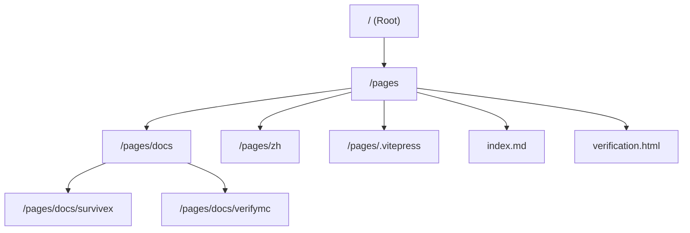
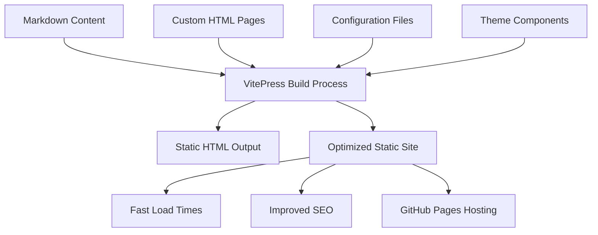
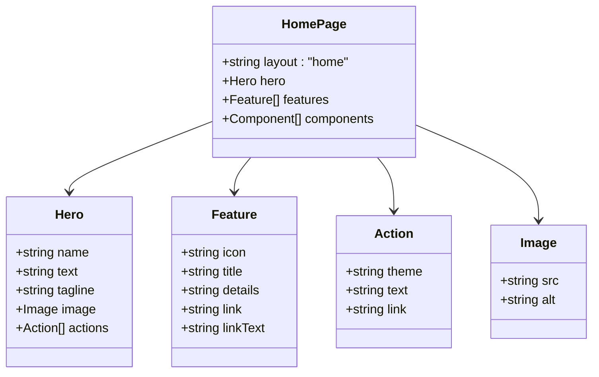
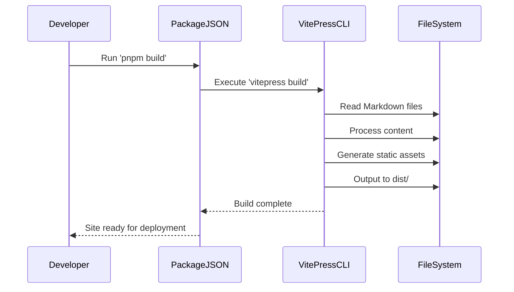

# Static Site Generation

<cite>
**Referenced Files in This Document**   
- [package.json](file://package.json)
- [pages/index.md](file://pages/index.md)
- [pages/verification.html](file://pages/verification.html)
- [pages/docs/survivex/index.md](file://pages/docs/survivex/index.md)
- [pages/docs/verifymc/index.md](file://pages/docs/verifymc/index.md)
- [README.md](file://README.md)
</cite>

## Table of Contents
1. [Introduction](#introduction)
2. [Project Structure](#project-structure)
3. [Core Components](#core-components)
4. [Architecture Overview](#architecture-overview)
5. [Detailed Component Analysis](#detailed-component-analysis)
6. [Dependency Analysis](#dependency-analysis)
7. [Performance Considerations](#performance-considerations)
8. [Troubleshooting Guide](#troubleshooting-guide)
9. [Conclusion](#conclusion)

## Introduction
This document provides a comprehensive overview of the static site generation system implemented using VitePress. The site serves as a documentation portal for KiteMC team projects, including SurviveX, VerifyMC, and Rainyun. The system transforms Markdown content into a fully optimized static website through a build process orchestrated by VitePress. This documentation details the transformation pipeline, entry point configuration, standalone HTML integration, build scripting, and performance characteristics of the generated site.

## Project Structure
The project follows a standard VitePress directory layout with content organized under the `/pages` directory. Documentation is structured in a hierarchical manner with separate sections for different projects (`survivex`, `verifymc`) and language variants (`zh`). The root directory contains configuration files and build scripts that control the site generation process.



**Diagram sources**
- [pages/index.md](file://pages/index.md#L1-L37)
- [pages/docs/survivex/index.md](file://pages/docs/survivex/index.md#L1-L34)

**Section sources**
- [pages/index.md](file://pages/index.md#L1-L37)
- [pages/docs/survivex/index.md](file://pages/docs/survivex/index.md#L1-L34)

## Core Components
The core components of the static site generation system include the VitePress framework, Markdown content files, and custom HTML pages. The system uses the root `index.md` as the homepage and entry point, which features a hero section with project highlights and navigation actions. Project-specific documentation is organized in dedicated subdirectories with their own index pages that follow VitePress conventions.

**Section sources**
- [pages/index.md](file://pages/index.md#L1-L37)
- [pages/docs/survivex/index.md](file://pages/docs/survivex/index.md#L1-L34)
- [pages/docs/verifymc/index.md](file://pages/docs/verifymc/index.md#L1-L34)

## Architecture Overview
The architecture follows a content-first approach where Markdown files are processed into static HTML pages during the build phase. VitePress handles the transformation, routing, and asset optimization automatically. The system supports multiple language versions through parallel directory structures and includes both standard documentation pages and standalone HTML interfaces for specific functionality.



**Diagram sources**
- [package.json](file://package.json#L1-L17)
- [pages/index.md](file://pages/index.md#L1-L37)

## Detailed Component Analysis

### Homepage and Navigation System
The homepage serves as the central entry point for the documentation portal, featuring a hero section with branding, tagline, and primary navigation actions. It uses VitePress's built-in home layout with custom features that highlight key projects and provide clear pathways to documentation.



**Diagram sources**
- [pages/index.md](file://pages/index.md#L1-L37)
- [pages/zh/index.md](file://pages/zh/index.md#L1-L37)

**Section sources**
- [pages/index.md](file://pages/index.md#L1-L37)
- [pages/zh/index.md](file://pages/zh/index.md#L1-L37)

### Verification Interface Integration
The `verification.html` page represents a standalone interface for user verification workflows. This custom HTML page exists alongside the VitePress-generated content and likely integrates with backend services to handle real-name email verification processes. It serves as a specialized endpoint that operates independently of the main documentation navigation.

**Section sources**
- [pages/verification.html](file://pages/verification.html#L1)

### Build Process and Scripting
The build process is orchestrated through npm scripts defined in `package.json`. These scripts leverage VitePress commands to handle development, building, and previewing of the static site. The configuration specifies development dependencies including VitePress, Vue, and Sass, ensuring a consistent build environment.



**Diagram sources**
- [package.json](file://package.json#L1-L17)
- [README.md](file://README.md#L1-L27)

**Section sources**
- [package.json](file://package.json#L1-L17)
- [README.md](file://README.md#L1-L27)

## Dependency Analysis
The project relies on VitePress as the core static site generator, with Vue 3 for component-based UI development. Additional dependencies include Sass for styling, TypeScript for type safety, and various utility packages. The dependency tree is optimized for static generation, with minimal runtime requirements in the output.

```mermaid
graph LR
A[VitePress] --> B[Vue 3]
A --> C[Vite]
A --> D[Markdown-It]
A --> E[Shiki]
B --> F[@vueuse/core]
D --> G[markdown-it-mathjax3]
H[Sass] --> A
I[TypeScript] --> A
J[@iconify/vue] --> A
```

**Diagram sources**
- [package.json](file://package.json#L1-L17)
- [package-lock.json](file://package-lock.json#L2951-L3044)

**Section sources**
- [package.json](file://package.json#L1-L17)

## Performance Considerations
The static site generation approach provides significant performance benefits, including near-instant page loads, improved search engine optimization, and reduced server costs. Since all content is pre-rendered during the build process, the resulting site can be served efficiently from CDN or static hosting platforms like GitHub Pages. The VitePress framework automatically optimizes assets, implements code splitting, and generates semantic HTML for maximum performance.

**Section sources**
- [README.md](file://README.md#L3)
- [package.json](file://package.json#L1-L17)

## Troubleshooting Guide
Common issues in the static site generation process typically relate to build configuration, content formatting, or deployment settings. Ensure that Node.js version 18.20+ is installed, dependencies are properly installed via pnpm, and the VitePress dev server can start without errors. Verify that all Markdown files follow proper frontmatter syntax and that custom HTML pages do not conflict with generated routes.

**Section sources**
- [README.md](file://README.md#L1-L27)
- [package.json](file://package.json#L1-L17)

## Conclusion
The VitePress-powered static site generation system provides a robust, high-performance solution for documentation delivery. By transforming Markdown content into optimized static HTML, the system achieves excellent load times and SEO characteristics while maintaining a simple content authoring workflow. The architecture supports multiple projects and languages through a clear directory structure, with extensibility for custom pages and integrations. The build process is well-documented and automated, making it easy to maintain and extend the documentation portal over time.