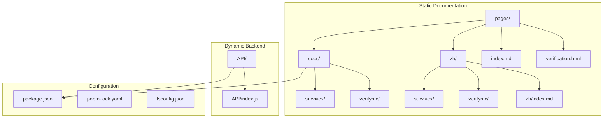
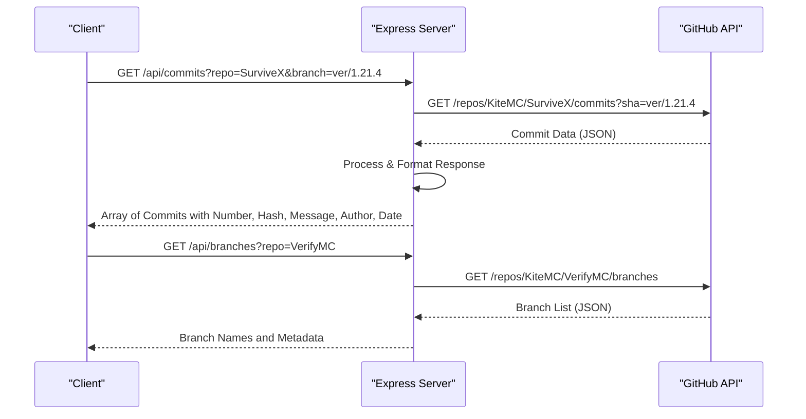
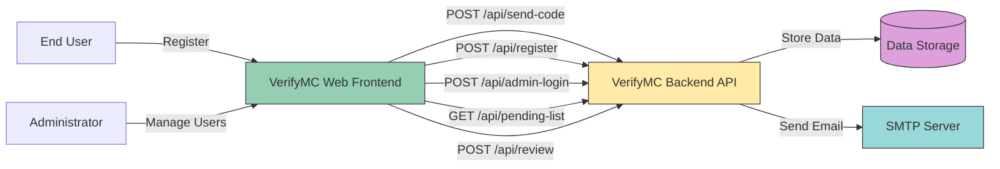

# System Overview

<cite>
**Referenced Files in This Document**   
- [README.md](file://README.md)
- [pages/index.md](file://pages/index.md)
- [pages/zh/index.md](file://pages/zh/index.md)
- [API/index.js](file://API/index.js)
- [pages/docs/verifymc/front/v1.md](file://pages/docs/verifymc/front/v1.md)
- [pages/zh/docs/verifymc/front/v1.md](file://pages/zh/docs/verifymc/front/v1.md)
- [package.json](file://package.json)
- [tsconfig.json](file://tsconfig.json)
</cite>

## Table of Contents
1. [Introduction](#introduction)
2. [Project Structure](#project-structure)
3. [Core Components](#core-components)
4. [Architecture Overview](#architecture-overview)
5. [Detailed Component Analysis](#detailed-component-analysis)
6. [Dependency Analysis](#dependency-analysis)
7. [Performance Considerations](#performance-considerations)
8. [Troubleshooting Guide](#troubleshooting-guide)
9. [Conclusion](#conclusion)

## Introduction
The KiteMC website serves as a hybrid documentation portal and API gateway for KiteMC team projects, including SurviveX and VerifyMC. It combines static documentation powered by VitePress with dynamic backend services built on Express.js. The system supports both English and Chinese content through parallel directory structures under `pages/docs` and `pages/zh`. This dual architecture enables seamless access to comprehensive guides and real-time GitHub data retrieval via RESTful endpoints. The integration between frontend documentation and backend APIs allows users to explore project details while interacting with live data, such as commit histories and plugin configurations. This document provides a high-level overview of the system, making it accessible to beginners while offering technical depth for developers aiming to extend or maintain the platform.

**Section sources**
- [README.md](file://README.md#L1-L26)
- [pages/index.md](file://pages/index.md#L1-L36)
- [pages/zh/index.md](file://pages/zh/index.md#L1-L36)

## Project Structure
The repository is organized into two primary sections: static documentation (`pages`) and dynamic API services (`API`). The `pages` directory contains Markdown-based documentation in both English (`pages/docs`) and Chinese (`pages/zh`), following a mirrored structure for consistent navigation. Each project (e.g., SurviveX, VerifyMC) has dedicated subdirectories with categorized content such as guides, deployment instructions, and file structures. The `API` directory houses an Express.js server that exposes endpoints for retrieving GitHub repository data, including commits and release tags. Configuration files like `package.json`, `pnpm-lock.yaml`, and `tsconfig.json` define dependencies and build settings, with VitePress as the core static site generator.



**Diagram sources**
- [pages/index.md](file://pages/index.md#L1-L36)
- [pages/zh/index.md](file://pages/zh/index.md#L1-L36)
- [API/index.js](file://API/index.js#L1-L91)
- [package.json](file://package.json#L1-L17)

**Section sources**
- [pages/index.md](file://pages/index.md#L1-L36)
- [pages/zh/index.md](file://pages/zh/index.md#L1-L36)
- [API/index.js](file://API/index.js#L1-L91)
- [package.json](file://package.json#L1-L17)

## Core Components
The system's core functionality is split between static documentation delivery and dynamic API services. The frontend uses VitePress to render Markdown content into a responsive website, supporting multi-language navigation through parallel `docs` and `zh` directories. The backend, implemented in `API/index.js`, provides RESTful endpoints for retrieving GitHub repository metadata, such as commit logs and branch lists. These APIs are consumed by both external clients and potentially integrated into the documentation interface for live data display. The `verification.html` file appears to be a domain verification token, indicating integration with external services or hosting platforms.

**Section sources**
- [README.md](file://README.md#L1-L26)
- [pages/index.md](file://pages/index.md#L1-L36)
- [API/index.js](file://API/index.js#L1-L91)
- [pages/zh/index.md](file://pages/zh/index.md#L1-L36)

## Architecture Overview
The KiteMC website follows a hybrid architecture combining static site generation with a lightweight Node.js backend. VitePress compiles Markdown files from `pages/docs` and `pages/zh` into static HTML, CSS, and JavaScript assets during the build process. These assets are served directly to users, ensuring fast load times and high availability. Concurrently, the Express.js server in `API/index.js` runs independently, exposing endpoints like `/api/commits` and `/api/branches` that fetch real-time data from GitHub repositories using the GitHub REST API. This separation allows the documentation to remain fast and secure while enabling dynamic features such as commit history browsing and release tracking.

```mermaid
graph LR
Client[User Browser] --> |HTTP Request| CDN[Static Assets CDN]
Client --> |API Request| Express[Express.js API Server]
CDN --> |Serves| VitePress[VitePress-Generated Site]
VitePress --> |Built from| Markdown[Markdown Files<br>(pages/docs/, pages/zh/)]
Express --> |Fetches| GitHub[GitHub API]
GitHub --> |Returns| CommitData[Commit & Branch Data]
Express --> |Responds with| JSON[JSON Response]
style VitePress fill:#4ECDC4,stroke:#333
style Express fill:#45B7D1,stroke:#333
style GitHub fill:#6C757D,stroke:#333
```

**Diagram sources**
- [README.md](file://README.md#L1-L26)
- [pages/index.md](file://pages/index.md#L1-L36)
- [API/index.js](file://API/index.js#L1-L91)

## Detailed Component Analysis

### Documentation System Analysis
The documentation system is built on VitePress, a Vue.js-based static site generator optimized for technical documentation. It supports frontmatter configuration for layout customization, as seen in the `index.md` files that define hero banners and feature cards for SurviveX, VerifyMC, and Rainyun. Multi-language support is implemented through directory-level isolation (`docs` for English, `zh` for Chinese), allowing maintainers to manage translations independently. The system leverages Vue components (e.g., `Contributors.vue`) within Markdown via script setup blocks, enabling interactive elements in otherwise static content.

```mermaid
flowchart TD
Start[Markdown Source] --> VitePressBuild[VitePress Build Process]
VitePressBuild --> |Converts| HTML[Static HTML/CSS/JS]
HTML --> |Deployed to| CDN[CDN or Web Server]
User[User Request] --> |Fetches| HTML
HTML --> |Renders| Browser[Client-Side]
subgraph "Dynamic Enhancements"
Component[Vue Components<br>(e.g., Contributors.vue)]
Script[Script Setup Blocks]
HTML --> Component
HTML --> Script
end
```

**Diagram sources**
- [pages/index.md](file://pages/index.md#L1-L36)
- [pages/zh/index.md](file://pages/zh/index.md#L1-L36)
- [tsconfig.json](file://tsconfig.json#L1-L22)

**Section sources**
- [pages/index.md](file://pages/index.md#L1-L36)
- [pages/zh/index.md](file://pages/zh/index.md#L1-L36)
- [tsconfig.json](file://tsconfig.json#L1-L22)

### API Service Analysis
The Express.js backend in `API/index.js` provides two primary endpoints: `/api/commits` and `/api/branches`. The `/api/commits` endpoint retrieves commit history from GitHub repositories, with special handling for VerifyMC to include the latest release tag. It supports query parameters for customizing the owner, repository, and branch. The `/api/branches` endpoint returns a list of all branches in a given repository. Both endpoints use Axios to communicate with the GitHub API, optionally authenticating with a `GITHUB_TOKEN` for higher rate limits. The server applies CORS middleware to allow cross-origin requests from the documentation frontend.



**Diagram sources**
- [API/index.js](file://API/index.js#L1-L91)

**Section sources**
- [API/index.js](file://API/index.js#L1-L91)

### VerifyMC Web Integration Analysis
The VerifyMC documentation includes detailed API specifications for its web-based management system, indicating tight integration between the plugin and the website. Endpoints such as `/api/send-code`, `/api/register`, and `/api/admin-login` support user registration and administrator functions. These APIs use JWT for authentication and return structured JSON responses. The documentation in `pages/docs/verifymc/front/v1.md` and its Chinese counterpart provides comprehensive endpoint references, request/response examples, and parameter descriptions, serving as both user guides and developer documentation.



**Diagram sources**
- [pages/docs/verifymc/front/v1.md](file://pages/docs/verifymc/front/v1.md#L1-L215)
- [pages/zh/docs/verifymc/front/v1.md](file://pages/zh/docs/verifymc/front/v1.md#L1-L189)

**Section sources**
- [pages/docs/verifymc/front/v1.md](file://pages/docs/verifymc/front/v1.md#L1-L215)
- [pages/zh/docs/verifymc/front/v1.md](file://pages/zh/docs/verifymc/front/v1.md#L1-L189)

## Dependency Analysis
The project relies on a modern JavaScript stack with clear separation between frontend and backend dependencies. The static site depends on VitePress, Vue 3, and associated tooling (`@vueuse/core`, `@iconify/vue`), while the API service uses Express.js and Axios. Both subsystems share Node.js as the runtime environment but operate independently. The `package.json` defines development scripts for building and previewing the site, while `pnpm-lock.yaml` ensures consistent dependency resolution. There are no direct code dependencies between the `pages` and `API` directories, suggesting they may be deployed as separate services.

```mermaid
graph TD
A[VitePress] --> B[Vue 3]
A --> C[@vueuse/core]
A --> D[@iconify/vue]
A --> E[Sass]
F[Express.js] --> G[Axios]
F --> H[CORS]
B --> I[Node.js Runtime]
G --> I
H --> I
style A fill:#4ECDC4,stroke:#333
style F fill:#45B7D1,stroke:#333
style I fill:#FFD700,stroke:#333
```

**Diagram sources**
- [package.json](file://package.json#L1-L17)
- [API/index.js](file://API/index.js#L1-L91)

**Section sources**
- [package.json](file://package.json#L1-L17)
- [API/index.js](file://API/index.js#L1-L91)

## Performance Considerations
The hybrid architecture optimizes performance by serving static documentation through CDN-friendly assets while isolating dynamic API operations. VitePress generates highly optimized static files with code splitting and lazy loading, ensuring fast initial page loads. The Express.js backend is lightweight and stateless, making it scalable for handling GitHub API proxy requests. However, the `/api/commits` endpoint performs pagination internally to retrieve all commits, which could impact response time for repositories with extensive histories. Caching strategies or client-side pagination could improve performance. The use of environment variables (e.g., `GITHUB_TOKEN`) allows for rate limit management on external API calls.

**Section sources**
- [API/index.js](file://API/index.js#L1-L91)
- [package.json](file://package.json#L1-L17)

## Troubleshooting Guide
Common issues may arise from misconfigured environment variables, particularly `GITHUB_TOKEN`, which affects API rate limits. Missing or incorrect `GITHUB_TOKEN` may result in 403 errors from GitHub's API. Deployment issues could occur if the VitePress build process fails due to syntax errors in Markdown files or missing dependencies. API endpoints may return 500 errors if GitHub's API is unreachable or returns unexpected data. Developers should verify CORS headers are properly set when integrating the API with frontend applications. Language-specific routing issues may occur if the `pages/docs` and `pages/zh` structures become misaligned.

**Section sources**
- [API/index.js](file://API/index.js#L1-L91)
- [README.md](file://README.md#L1-L26)

## Conclusion
The KiteMC website effectively combines static documentation and dynamic API services to serve as a comprehensive portal for its projects. The use of VitePress ensures maintainable, high-performance documentation with built-in support for multi-language content. The Express.js backend extends functionality by providing real-time access to GitHub repository data, enhancing the user experience with live information. This hybrid approach allows the team to maintain clear separation of concerns while delivering an integrated user experience. Future improvements could include API response caching, enhanced error handling, and deeper integration between documentation and dynamic data displays.