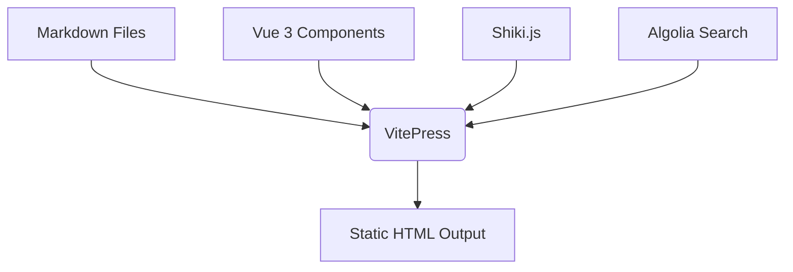
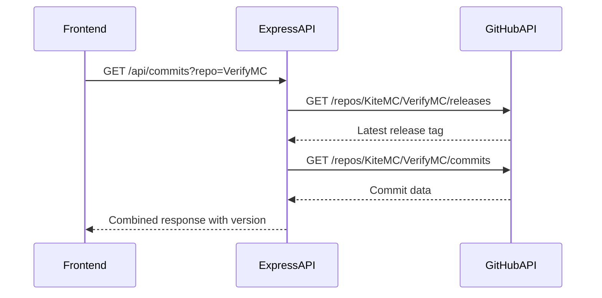

# Technology Stack

<cite>
**Referenced Files in This Document**   
- [package.json](file://package.json)
- [tsconfig.json](file://tsconfig.json)
- [API/index.js](file://API/index.js)
- [API/package.json](file://API/package.json)
- [pnpm-lock.yaml](file://pnpm-lock.yaml)
</cite>

## Table of Contents
1. [Frontend Framework: VitePress with Vue 3](#frontend-framework-vitepress-with-vue-3)
2. [Backend API: Express.js for GitHub Integration](#backend-api-expressjs-for-github-integration)
3. [Type Safety with TypeScript](#type-safety-with-typescript)
4. [Supporting Libraries: Axios and HTTP Clients](#supporting-libraries-axios-and-http-clients)
5. [Build Tooling and Workflow Orchestration](#build-tooling-and-workflow-orchestration)
6. [Configuration and Compilation Settings](#configuration-and-compilation-settings)
7. [Dependency Management with pnpm](#dependency-management-with-pnpm)

## Frontend Framework: VitePress with Vue 3

The frontend of the website is built using **VitePress**, a modern static site generator specifically designed for documentation. VitePress leverages **Vue 3** as its core frontend framework, enabling reactive and component-based UI development. It supports writing content in **Markdown**, which is seamlessly integrated with Vue components, allowing dynamic interactivity within static documentation pages.

VitePress provides built-in features such as search (powered by Algolia), syntax highlighting (via Shiki), and responsive design out of the box. The use of Vue 3 enables advanced composition API patterns, making it easier to manage complex UI logic in components like the Contributors widget used in the homepage.



**Diagram sources**
- [package.json](file://package.json#L2-L10)
- [pages/zh/index.md](file://pages/zh/index.md#L16-L36)

**Section sources**
- [package.json](file://package.json#L2-L10)
- [pages/zh/index.md](file://pages/zh/index.md#L16-L36)

## Backend API: Express.js for GitHub Integration

The backend API, located in the `API/` directory, is powered by **Express.js**, a minimal and flexible Node.js web application framework. It serves as a proxy to fetch data from the GitHub API, particularly for retrieving commit histories and branch information for repositories like **SurviveX** and **VerifyMC**.

The `/api/commits` endpoint dynamically fetches commits from a specified repository and branch, with special handling for **VerifyMC** to include the latest release tag. The `/api/branches` endpoint retrieves available branches, enabling version-aware documentation. The API uses **CORS** middleware to allow cross-origin requests from the frontend and includes optional **GitHub token authentication** for higher rate limits.



**Diagram sources**
- [API/index.js](file://API/index.js#L15-L91)
- [API/package.json](file://API/package.json#L1-L14)

**Section sources**
- [API/index.js](file://API/index.js#L15-L91)
- [API/package.json](file://API/package.json#L1-L14)

## Type Safety with TypeScript

**TypeScript** is used across both frontend and backend to enforce type safety and improve developer experience. In the frontend, TypeScript enhances VitePress theme components and custom Vue components, ensuring correct props and state handling. In the backend, although the API is written in JavaScript, TypeScript is listed as a dependency, indicating potential for future migration or shared type definitions.

The `tsconfig.json` file configures the TypeScript compiler with modern settings such as `ESNext` modules, `Bundler` module resolution, and support for JSON modules. This setup ensures compatibility with modern tooling and enables features like path aliases (`@/*`), which simplify imports across the codebase.

**Section sources**
- [tsconfig.json](file://tsconfig.json#L1-L23)
- [package.json](file://package.json#L14-L17)

## Supporting Libraries: Axios and HTTP Clients

**Axios** is the primary HTTP client used in the backend API to communicate with the GitHub REST API. It provides a promise-based interface for making requests, supports request/response interception, and handles JSON parsing automatically. Axios is used to fetch repository data with proper headers, including the `User-Agent` and optional `Authorization` token.

The API uses Axios to handle paginated responses from GitHub, iterating through multiple pages of commits when necessary. This ensures that all available commit data is retrieved, even when exceeding the default 100-commit limit per page.

**Section sources**
- [API/index.js](file://API/index.js#L1-L91)
- [API/package.json](file://API/package.json#L1-L14)

## Build Tooling and Workflow Orchestration

The project uses **pnpm** as its package manager, offering faster installations and efficient disk usage through hard linking. The `package.json` scripts define the development and production workflows:

- `dev`: Starts VitePress in development mode with hot reloading
- `build`: Compiles the documentation into static assets
- `preview`: Serves the built static site locally

These scripts are orchestrated through pnpm, ensuring consistent execution across environments. The use of Vite as the underlying build tool provides fast cold starts and optimized builds through ES modules.

**Section sources**
- [package.json](file://package.json#L11-L13)
- [pnpm-lock.yaml](file://pnpm-lock.yaml#L1-L10)

## Configuration and Compilation Settings

The `tsconfig.json` file defines key compilation options that affect both development and production builds. The `include` field specifies which directories contain TypeScript files, focusing on `.vitepress` and `pages` directories. The `paths` option enables absolute imports using the `@/*` alias, improving import readability.

Compiler options such as `esModuleInterop` and `allowSyntheticDefaultImports` ensure compatibility with CommonJS modules, while `skipLibCheck` speeds up compilation by skipping type checking of declaration files.

```json
{
  "compilerOptions": {
    "module": "ESNext",
    "moduleResolution": "Bundler",
    "lib": ["esnext", "dom"],
    "baseUrl": ".",
    "paths": { "@/*": ["*"] },
    "esModuleInterop": true,
    "allowSyntheticDefaultImports": true,
    "resolveJsonModule": true,
    "skipLibCheck": true
  },
  "include": [
    ".vitepress/**/*.ts",
    ".vitepress/**/*.mts",
    ".vitepress/theme/components/**/*.ts",
    ".vitepress/**/*.vue",
    "pages/**/*.ts"
  ],
  "exclude": ["node_modules"]
}
```

**Section sources**
- [tsconfig.json](file://tsconfig.json#L1-L23)

## Dependency Management with pnpm

The project uses **pnpm** for dependency management, as evidenced by the presence of `pnpm-lock.yaml`. This lockfile ensures deterministic installations and efficient dependency resolution. The lockfile shows a flat dependency structure with clear version resolution and peer dependency handling.

Key dependencies include:
- **VitePress 1.6.3**: Static site generator
- **Vue 3.5.17**: Frontend framework
- **TypeScript 5.8.3**: Type checking
- **Axios 1.6.7**: HTTP client
- **Express 4.19.2**: Backend framework

The use of pnpm enables workspace-wide dependency sharing and reduces duplication, which is particularly beneficial for a documentation site with multiple interrelated components.

**Section sources**
- [pnpm-lock.yaml](file://pnpm-lock.yaml#L1-L10)
- [package.json](file://package.json#L1-L17)
- [API/package.json](file://API/package.json#L1-L14)